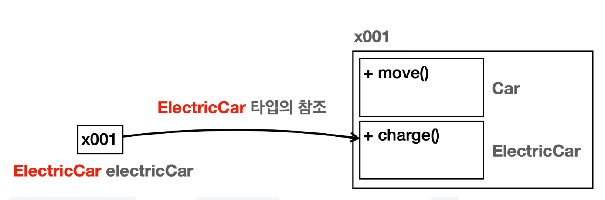
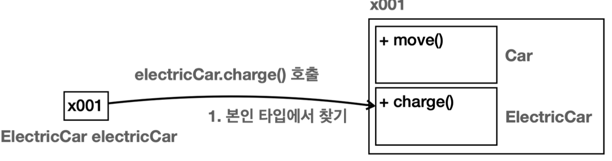
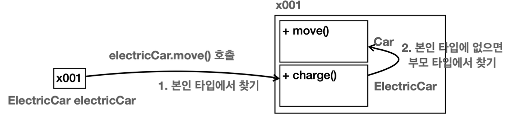
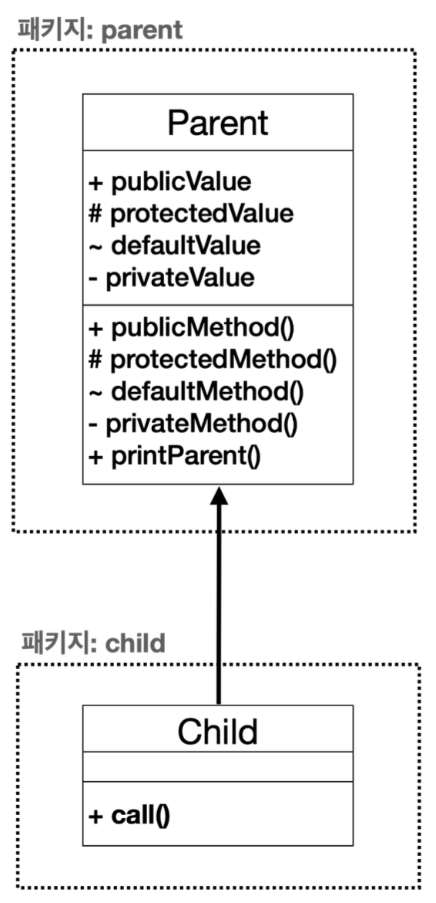
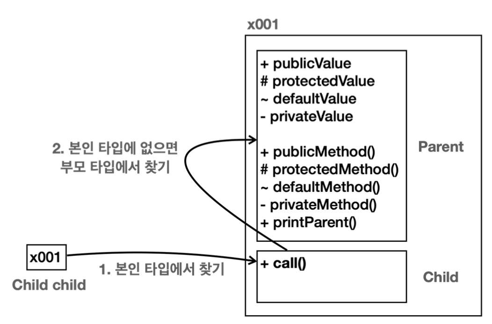
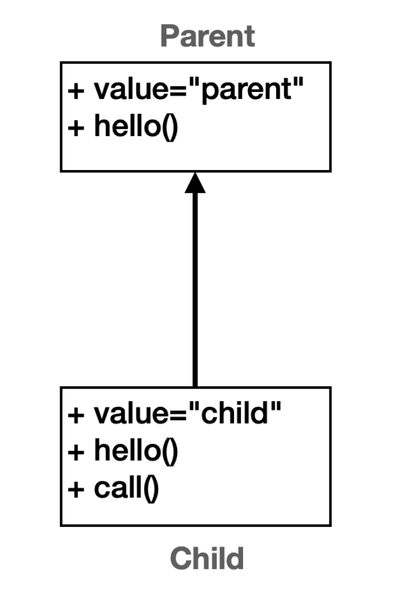
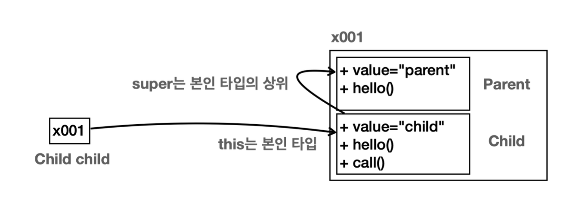
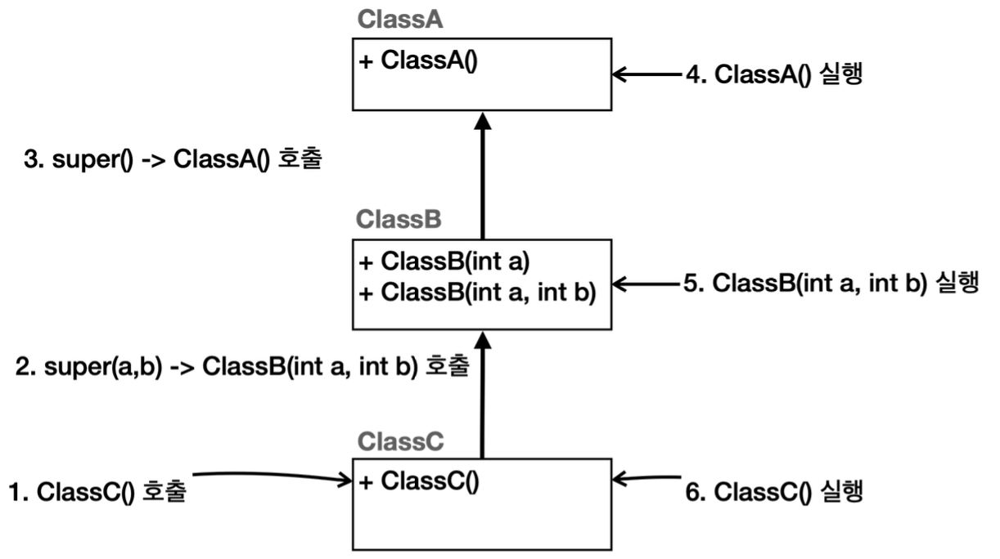

# 상속

## 상속 관계

상속은 객체 지향 프로그래밍의 핵심 요소 중 하나로, 기존 클래스의 필드와 메서드를 새로운 클래스에서 **재사용**하게 해준다.

이름 그대로 기존 클래스의 속성과 기능을 물려받는 것이다.

`extends`키워드를 사용하여 상속할 수 있다.

**`extends`의 대상은 하나만 선택할 수 있다.**

- 부모 클래스 (슈퍼 클래스)
  - 상속을 통해 자신의 필드와 메서드를 다른 클래스에 제공하는 클래스
  - 부모 자체는 자식에 대한 정보는 하나도 없다
- 자식 클래스 (서브 클래스)
  - 부모 클래스로부터 필드와 메서드를 상속받는 클래스

## 단일 상속

> 자바는 다중 상속을 지원하지 않는다. 즉, 하나의 자식이 두 개의 부모를 가지지는 못한다.  
> (`extends` 대상은 하나만 선택할 수 있다.)

다중 상속을 사용하면 클래스 계층 구조가 매우 복잡해 질 수 있고, 여러 모호한 문제를 가지기 때문이다.

자바에서는 인터페이스의 다중 구현을 허용해서 이러한 문제를 피한다.


## 상속과 메모리 구조 (중요!)

```java
ElectricCar electricCar = new ElectricCar();
```


`new ElectricCar()` 를 호출하면 `ElectricCar` 뿐만 아니라 상속 관계에 있는 `Car` 까지 함께 포함해서 인스턴스를 생성한다.  

참조값은 `x001` 로 하나이지만 실제로 그 안에서는 `Car` , `ElectricCar` 라는 두가지 클래스 정보가 공존하는 것이다.  
외부에서 볼때는 하나의 인스턴스를 생성하는 것 같지만 내부에서는 **부모와 자식이 모두 생성되고** 공간도 구분된다.
 

### 자신의 메서드 호출 시

> 본인 타입에서 먼저 찾는다.

**`electricCar.charge()` 호출** 



상속 관계의 경우에는 내부에 부모와 자식이 모두 존재한다.  
이때 부모인 `Car` 를 통해서 `charge()` 를 찾을지 아니면 `ElectricCar` 를 통해서 `charge()` 를 찾을지 선택해야 한다.
이때는 **호출하는 변수의 타입(클래스)을 기준으로 선택**한다.  

`electricCar` 변수의 타입이 `ElectricCar` 이므로 인스턴스 내부에 같은 타입인 `ElectricCar` 를 통해서 `charge()` 를 호출한다.

### 부모의 메서드 호출 시

> 본인 타입에서 먼저 찾고 (없을테니까) 이후 부모 타입에서 찾는다.

**`electricCar.move()` 호출**



`ElectricCar` 에는 `move()` 메서드가 없다.  

상속 관계에서는 자식 타입에 해당 기능이 없으면 부모 타입으로 올라가서 찾는다.  
이 경우 `ElectricCar` 의 부모인 `Car` 로 올라가서 `move()` 를 찾는다.  
부모인 `Car` 에 `move()` 가 있으므로 부모에 있는 `move()` 메서드를 호출한다.  

만약 부모에서도 해당 기능을 찾지 못하면 더 상위 부모에서 필요한 기능을 찾아본다. 부모에 부모로 계속 올라가면서 필드나 메서드를 찾는 것이다. 물론 계속 찾아도 없으면 **컴파일 오류**가 발생한다.

### 상속과 메모리 구조 정리

- 상속 관계의 객체를 생성하면 그 **내부에는 부모와 자식이 모두 생성**된다.
- 상속 관계의 객체를 호출할 때, `대상 타입`을 정해야 한다. 이때 **호출자의 타입을 통해 `대상 타입`을 찾는다.**
- 현재 타입에서 기능을 **찾지 못하면 상위 부모 타입으로** 기능을 찾아서 실행한다. 기능을 찾지 못하면 **컴파일 오류**가 발생한다.


## 상속과 기능 추가

부모 클래스의 하나의 기능을 추가하면, 그 부모를 상속하는 모든 자식 클래스에서도 해당 기능을 사용할 수 있을 것이다.

상속 덕분에 자식 클래스 간 중복은 줄어들고, 확장성은 증가한다.

## 상속과 접근 제어

접근 제어를 사용하기 위해 부모와 자식의 패키지를 분리하였다.



- `+` : public (모든 외부 호출)
- `#` : protected (같은 패키지 안에서, 패키지가 달라도 상속 관계면 호출)
- `~` : default (같은 패키지 안에서)
- `-` : private (모든 외부 호출 금지)

`private -> defualt -> protected -> public` 

```java
package extends1.access.child;

import extends1.access.parent.Parent;

public class Child extends Parent {
    public void call() {
        publicValue = 1;
        protectedValue = 1; // 상속 관계 (같은 패키지는 아니지만 가능)
        // defaultValue = 1; // 다른 패키지 접근 불가, 컴파일 오류
        // privateValue = 1; // 접근 불가, 컴파일 오류

        publicMethod();
        protectedMethod(); // 상속 관계 (같은 패키지는 아니지만 가능)
        // defaultMethod();
        // privateMethod();

        printParent(); // public 메서드이므로 당연히 가능함
    }
}
```

### 접근 제어와 메모리 구조



본인 타입에 없으면 부모 타입에서 기능을 찾는데, 이때 접근 제어자가 영향을 준다.  
왜냐하면 **객체 내부에서는 자식과 부모가 구분**되어 있기 때문이다. 

> 자식 타입에서 부모 타입의 기능을 호출할 때, **부모 입장에서 보면 외부에서 호출한 것과 같다.**

## super


### super - 부모 참조
부모와 자식의 필드명이 같거나 메서드가 오버라이딩 되어 있으면, `super` 키워드를 사용하면 부모를 참조할 수 있다.

> `super` 는 이름 그대로 **부모 클래스에 대한 참조**를 나타낸다.



```java
package extends1.super1;

public class Child extends Parent {
    public String value = "Child";

    @Override
    public void hello() {
        System.out.println("Child.hello");
    }

    public void call() {
        System.out.println("this value = " + this.value);
        System.out.println("super value = " + super.value); // 나의 부모 타입에서 value 필드 찾기
        System.out.println("value = " + value); // 생략하면 현재 타입부터 찾기

        this.hello(); //따라서 this 생략 가능
        super.hello();
    }
}
```

- `this` : 자기 자신의 참조 
  - `this` 는 생략할 수 있다.
- `super` : 부모 클래스 참조 
  - 필드 이름과 메서드 이름이 같지만(오버라이딩) `super` 를 사용해서 부모 클래스에 있는 기능을 사용할 수 있다.

#### SuperMain 메모리 그림

```java
package extends1.super1;

public class SuperMain {
    public static void main(String[] args) {
        Child child = new Child();
        child.call();
    }
}
```



### super - 생성자

> **상속 관계를 사용하면 자식 클래스의 생성자에서 부모 클래스의 생성자를 반드시 호출해야 한다.(규칙)**

메모리 내부에는 자식과 부모 클래스가 각각 다 만들어진다.  
따라서 각각의 생성자도 모두 호출되어야 한다.  
상속 관계에서 부모의 생성자를 호출할 때는 `super(...)` 를 사용하면 된다. 

```java
package extends1.super2;

public class ClassA {
  public ClassA() {
    System.out.println("ClassA 생성자");
  }
}
```
- 최상위 부모 클래스

```java
package extends1.super2;

public class ClassB extends ClassA{
    public ClassB(int a) {
        super(); // 부모의 기본 생성자 (생략 가능)
        System.out.println("ClassB 생성자 a = " + a);
    }

    public ClassB(int a, int b) {
        super();
        System.out.println("ClassB의 생성자 a =" + a + ", b = " + b);
    }
}
```
- `ClassB` 는 `ClassA` 를 상속 받았다. 상속을 받으면 **생성자의 첫줄**에 `super(...)` 를 사용해서 부모 클래스의 생성자를 호출해야 한다. 
  - **예외로 생성자 첫줄에 `this(...)` 를 사용할 수는 있다.** 하지만 `super(...)` 는 자식의 생성자 안에서
  언젠가는 반드시 호출해야 한다.

- 부모 클래스의 생성자가 기본 생성자(파라미터가 없는 생성자)인 경우에는 `super()` 를 생략할 수 있다.
  - 상속 관계에서 첫줄에 `super(...)` 를 생략하면 자바는 부모의 기본 생성자를 호출하는 `super()` 를 자동으로 만들어준다.

```java
package extends1.super2;

public class ClassC extends ClassB{
    public ClassC() {
        super(10, 20);
        System.out.println("ClassC 생성자");
    }
}
```

- `ClassB`의 생성자 (기본 생성자가 없다.)
  - `ClassB(int a)`
  - `ClassB(int a, int b)`
- 생성자는 하나만 호출할 수 있다. 두 생성자 중에 하나를 선택하면 된다.
- 부모의 기본 생성자를 호출하는 `super()` 를 사용하거나 생략할 수 없다.



생성자를 통한 초기화는 **최상위 부모에서부터 이루어진다.**  
-> 자식 생성자의 첫줄에서 부모의 생성자를 호출하기 때문이다.

# 클래스와 메서드에 사용되는 final
## 클래스에 `final` -> 상속 끝!
`final` 로 선언된 클래스는 확장될 수 없다. 다른 클래스가 `final` 로 선언된 클래스를 상속받을 수 없다. 예: `public final class MyFinalClass {...}`

## 메서드에 `final` -> 오버라이딩 끝!
`final` 로 선언된 메서드는 오버라이드 될 수 없다. 상속받은 서브 클래스에서 이 메서드를 변경할 수 없다. 예: `public final void myFinalMethod() {...}`