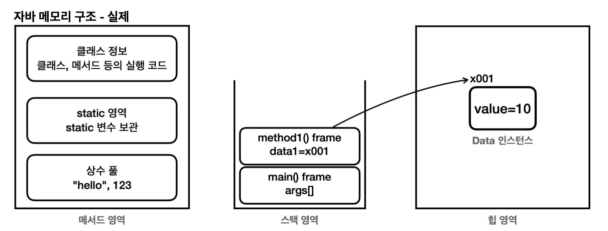
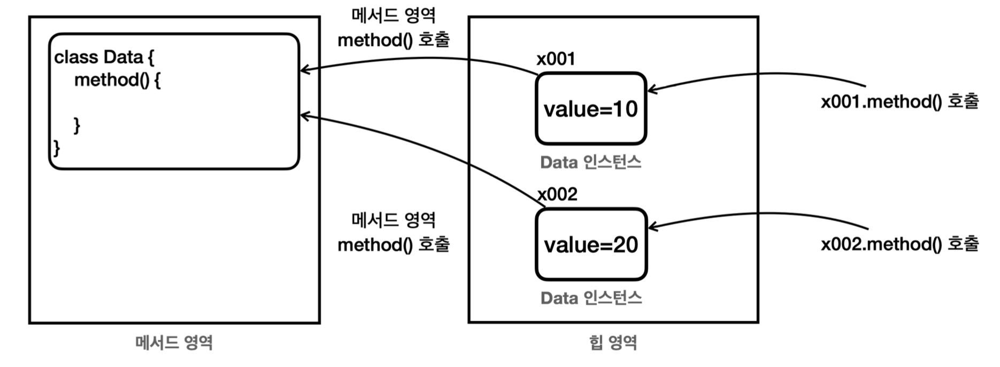

# 자바 메모리 구조와 static

## 자바 메모리 구조

자바 실행 시 JVM은 다음과 같은 메모리 영역을 가진다.

- **메서드 영역**: 클래스 정보를 보관한다. 이 클래스 정보가 붕어빵 틀이다.
- **스택 영역**: 실제 프로그램이 실행되는 영역이다. 메서드를 실행할 때 마다 하나씩 쌓인다.
- **힙 영역**: 객체(인스턴스)가 생성되는 영역이다. `new` 명령어를 사용하면 이 영역을 사용한다. 쉽게 이야기해서 붕 어빵 틀로부터 생성된 붕어빵이 존재하는 공간이다. 참고로 배열도 이 영역에 생성된다.

### 자바 메모리 구조 - 실제



- **메서드 영역(Method Area)**
  - 메서드 영역은 프로그램을 실행하는데 필요한 공통 데이터를 관리 (프로그램의 모든 영역에서 공유)
  - 클래스 정보: 클래스의 실행 코드(바이트 코드), 필드, 메서드와 생성자 코드등 모든 실행 코드
  - static 영역: `static` 변수들을 보관
  - 런타임 상수 풀: 프로그램을 실행하는데 필요한 공통 리터럴 상수를 보관한다. 예를 들어서 프로그램에
  `"hello"` 라는 리터럴 문자가 있으면 이런 문자를 공통으로 묶어서 관리한다. 이 외에도 프로그램을 효율 적으로 관리하기 위한 상수들을 관리한다. (참고로 문자열을 다루는 문자열 풀은 자바 7부터 힙 영역으로 이 동했다.)
- **스택 영역(Stack Area)**
  - 자바 실행 시, 하나의 실행 스택이 생성된다. 각 스택 프레임은 지역 변수, 중간 연산 결과, 메서드 호출 정보 등을 포함한다. 
  - 스택 프레임: 스택 영역에 쌓이는 네모 박스가 하나의 스택 프레임이다. 메서드를 호출할 때 마다 하나의 스택 프레임이 쌓이고, 메서드가 종료되면 해당 스택 프레임이 제거된다. (지역 변수들도 스택 프레임에 포함)
- **힙 영역(Heap Area)**
  - 객체(인스턴스)와 배열이 생성되는 영역 (`new`해서 생기는 인스턴스들)
  - 가비지 컬렉션(GC)이 이루어지는 주요 영역이며, 더 이상 참조되지 않는 객체는 GC에 의해 제거된다.

> 스택 영역은 더 정확히는 각 쓰레드별로 하나의 실행 스택이 생성된다. 따라서 쓰레드 수 만큼 스택 영역이 생성된다. 지금은 쓰레드를 1개만 사용하므로 스택 영역도 하나이다. 쓰레드에 대한 부분은 멀티 쓰레드를 학습해 야 이해할 수 있다.

### 메서드 코드는 메서드 영역에



자바에서 특정 클래스로 100개의 인스턴스를 생성하면, 힙 메모리에 100개의 인스턴스가 생긴다. 

각각의 인스턴스는 내부에 변수와 메서드를 가진다. 
모든 인스턴스는 공통된 메서드 코드를 공유한다. 따라서 객체가 생성될 때, 인스턴스 변수에는 메모리가 할당되지만, _**메서드에 대한 새로운 메모리 할당은 없다.**_ 

메서드는 메서드 영역에서 공통으로 관리되고 실행된다.  
정리하면 인스턴스의 메서드를 호출하면 실제로는 메서드 영역에 있는 코드를 불러서 수행한다.

### 정리
- 자바는 스택 영역을 사용해서 메서드 호출과 지역 변수(매개변수 포함)를 관리한다. 메서드를 계속 호출하면 스택 프레임이 계속 쌓인다.
- 지역 변수(매개변수 포함)는 스택 영역에서 관리한다.
- 스택 프레임이 종료되면 지역 변수도 함께 제거된다.
- 스택 프레임이 모두 제거되면 프로그램도 종료된다.

지역 변수는 스택 영역에, 객체(인스턴스)는 힙 영역에 관리된다. 

## static

### static 변수

특정 클래스에서 공용으로 함께 사용할 수 있는 변수를 만들 수 있다면 편리할 것이다.  
`static` 키워드를 사용하면 공용으로 함께 사용하는 변수를 만들 수 있다.

```java
package static1;

public class Data3 {
    public String name;
    public static int count; // static 변수 !
    // 멤버 변수에 static을 붙이게 되면, static 변수, 정적 변수 또는 클래스 변수라 한다.
    
    public Data3 (String name) {
        this.name = name;
        count++;
    // 객체가 생성되면 생성자에서 정적 변수 count의 값을 하나 증가시킨다.
    }
}
```

```java
package static1;

public class DataCountMain3 {
    public static void main(String[] args) {
        Data3 data1 = new Data3("A");
        System.out.println("A count=" + Data3.count);

        Data3 data2 = new Data3("B");
        System.out.println("B count=" + Data3.count);

        Data3 data3 = new Data3("C");
        System.out.println("C count=" + Data3.count);
    }
}
```

```text
A count=1
B count=2
C count=3
```

- `static`이 붙은 멤벼 변수는 **메서드 영역**에서 관리한다.
  - `count`는 인스턴스 영역에 생성되지 않는다. 대신 메서드 영역에서 이 변수를 관리한다. (따라서 메서드처럼 딱 한번 메모리에 올라감)

### 사용

`static` 이 붙은 정적 변수에 접근하려면 `Data3.count` 와 같이 클래스명 + `.` (dot) + 변수명으로 접근하면 된다.

```
Data3.count // 클래스명.변수명으로 접근하기
```
참고로 `Data3` 의 생성자와 같이 자신의 클래스에 있는 정적 변수라면 클래스명을 생략할 수 있다.  
`static` 변수를 사용한 덕분에 공용 변수를 사용해서 편리하게 문제를 해결할 수 있었다.

### 정리

#### 멤버 변수(필드)의 종료

- **인스턴스 변수**
  - `static`이 붙지 않은 멤버 변수
  - 인스턴스를 생성해야 사용할 수 있음
  - 인스턴스를 생성할 때마다 새로 만들어짐
- **클래스 변수**
  - 클래스 변수, 정적 변수, `static`변수 등 **용어를 모두 사용하니 주의하자**
  - 인스턴스와 무관하게 클래스에 바로 접근해서 사용 가능
  - 클래스 자체에 소속됨
  - 메모리 영역 중 메서드 영역에 존재
  - 자바 프로그램을 시작할 때 딱 1개가 만들어진다

#### 변수와 생명주기

|       | **지역 변수**            | **인스턴스 (멤버)변수**           | **클래스 변수**             |
|-------|----------------------|---------------------------|------------------------|
| 위치    | 스택 영역                | 힙 영역                      | 메서드 영역 안 static 영역     |
| 생존 주기 | 짧다                   | 지역변수보다 길다                 | 가장 길다                  |
| 제거 시점 | 메서도 종료 시 스택 프레임에서 제거 | GC가 관리 (인스턴스가 참조되지 않을 경우) | JVM 로딩 시 생성 - JVM 종료 시 |

`static` 이 정적이라는 이유는 바로 여기에 있다. 

`static` 인 정적 변수는 거의 프로그램 실행 시점에 딱 만들어지고, 프로그램 종료 시점에 제거된다.   
이름 그대로 정적이다.

### 접근법

```java
//인스턴스를 통한 접근
Data3 data4 = new Data3("D"); 
System.out.println(data4.count);
//클래스를 통합 접근 System.out.println(Data3.count);
```

- 클래스를 통해 접근하기 (추천)
  - `Data3.count`
  - 클래스에서 공용으로 관리하기 때문에 클래스를 통해서 접근하는 것이 더 명확
- 인스턴스를 통해 접근하기 (비추천)
  - `data4.count`
  - 인스턴스 변수와 혼동 위험

