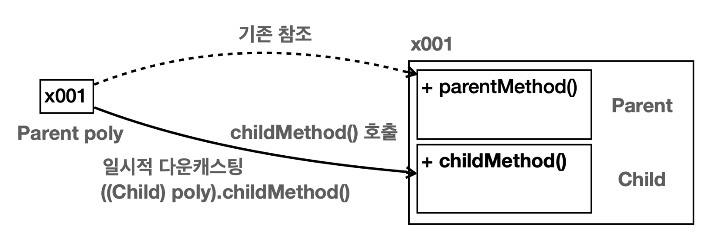
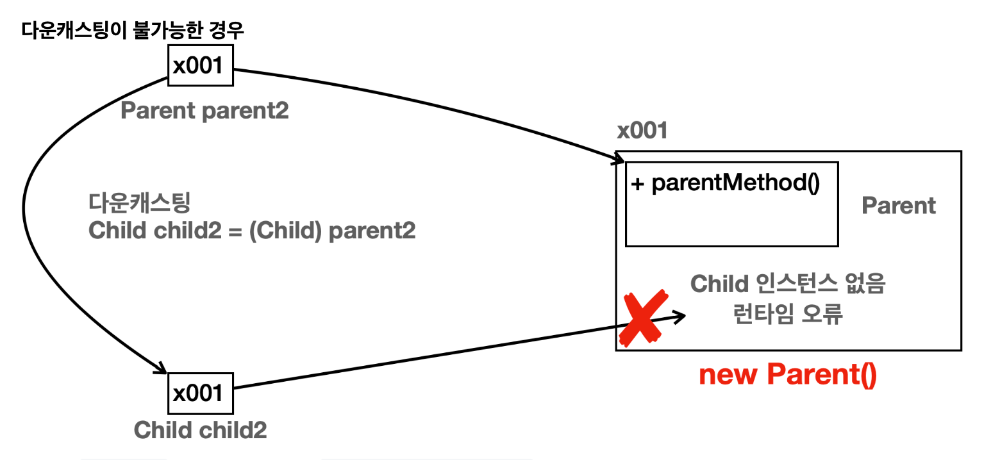
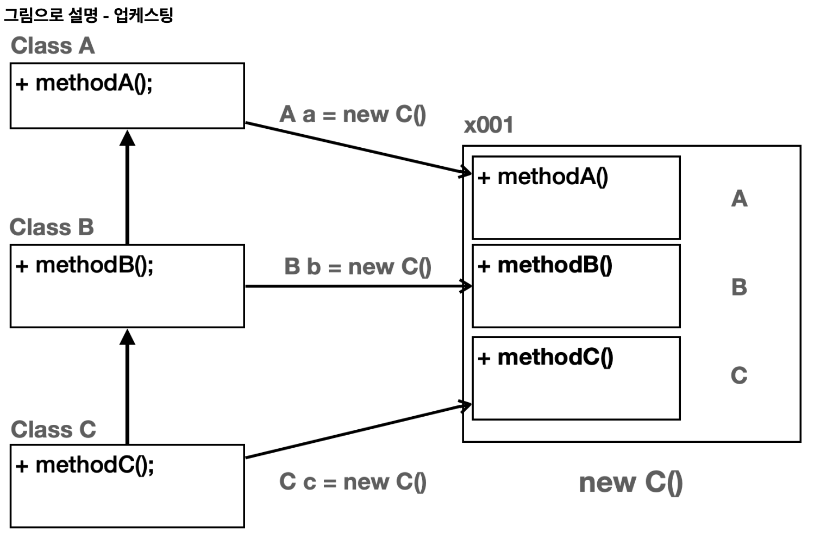
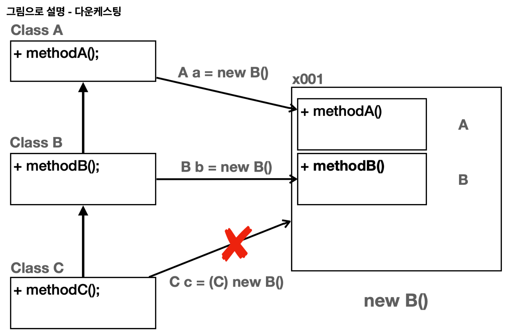
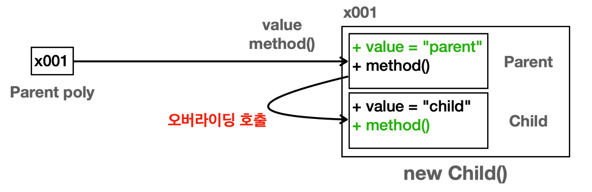

# 다형성 - 1

다형성은 한 객체가 여러 타입의 객체로 취급될 수 있는 능력을 뜻한다.

보통 하나의 객체는 하나의 타입으로 고정되어 있다. 그러나 다형성을 사용하면, 하나의 객체가 다른 타입으로 사용될 수 있다.

**다형성의 핵심 이론**
- 다형적 참조
- 메서드 오버라이딩

## 다형적 참조

```java
package poly.basic;

public class PolyMain {
    public static void main(String[] args) {
    //부모 변수가 부모 인스턴스 참조
        System.out.println("Parent -> Parent");
        Parent parent = new Parent();
        parent.parentMethod();
        //Parent 인스턴스 생성, 메모리 상에 Parent만 생성 (자식은 생성되지 않는다!!)
        //생성된 참조값은 parent 변수에 저장

        //자식 변수가 자식 인스턴스 참조
        System.out.println("Child -> Child");
        Child child = new Child();
        child.parentMethod();
        child.childMethod();
        //메모리 상에 child와 parent가 모두 생성된다.
        //생성된 Child 참조값을 Child타입 변수인 child에 담아준다


        //부모 변수가 자식 인스턴스를 참조하는 경우(다형적 참조)
        System.out.println("Parent -> Child");
        Parent poly = new Child();//부모 타입은 자식을 참조할 수 있다.
        poly.parentMethod();
        
//        Child poly1 = new Parent(); //컴파일 에러
    }
}
```
`Parent poly = new Child();`  


- 변수의 타입에 따라 무엇을 호출할 지 결정
  - `Parent`타입 변수 -> `parentMethod` 찾음
  - 바로 `Parent`부터 찾는다
- 메모리 상에 Child, Parent 둘 다 생성 (Child 인스턴스를 만들었기 때문)
- 생성된 참조값은 Parent 타입 변수인 ploy에 담아둔다.
- 자식의 기능은 호출할 수 없다.
  

`Parent`타입 변수는 자식 타입까지 참조할 수 있다. (그 자식의 자식도 가능)
- `Parent poly = new Parent()`
- `Parent poly = new Child()`
- `Parent poly = new Gardson()` (Child 하위 손자)

> 자바에서 부모 타입은 자신은 물론이고, 자신을 기준으로 하는 모든 자식 타입을 참조할 수 있다.
> 
> 이것이 바로 다양한 형태를 참조할 수 있다 하여 **다형적 참조**라 한다.

### 다형적 참조의 한계

```java
Parent poly = new Child();//부모 타입은 자식을 참조할 수 있다.
poly.childMethod(); 
```
`poly.childMethod()`를 한 경우 어떻게 될까?


- `poly`의 타입에 따라 `Parent` 클래스부터 시작해서 필요한 기능을 찾는다.
- **상속 관계는 부모 방향으로 찾아 올라갈 수는 있지만 자식 방향으로 내려갈 수는 없다.**
- 따라서 `childMethod()`를 찾을 수 없으므로 **컴파일 오류**가 발생한다.

### 다형적 참조의 핵심

**다형적 참조의 핵심은 `부모는 자식을 품을 수 있다`는 것이다.**

## 다형성과 캐스팅
 
상속 관계는 자식에서 부모로만 찾아 올라갈 수 있으므로 `poly.childMethod`는 불가능했다.

### 다운캐스팅
다운캐스팅을 사용하면 자식 타입 변수에 인스턴스의 `Child`에 있는 `childMethod`를 호출할 수 있다.

```java
Child child = (Child) poly; //Parent poly
child.childMethod();
```
`poly`를 `(Child)`를 사용해서 일시적으로 자식 타입인 `Child`타입으로 변경하였다.


**실행 순서**
1. 다운캐스팅을 통해 부모 타입을 자식 타입으로 변환 후 대입 시도  
   `Child child = (Child) poly`
2. 참조값을 읽은 다음 자식 타입으로 지정  
   `Child child = (Child) x001`
3. child에 할당  
   `Child child = x001`

캐스팅을 한다고 해서 `Parent poly` 의 타입이 변하는 것은 아니다.  
해당 **참조값을 꺼내고 꺼낸 참조값이 `Child` 타입이 되는 것**이다.  

따라서 `poly` 의 타입은 `Parent` 로 기존과 같이 유지된다.

### 캐스팅 용어

- `업캐스팅(upcasting)`: 부모 타입으로 변경 
- `다운캐스팅(downcasting)`: 자식 타입으로 변경

### 캐스팅의 종류

### 일시적 다운 캐스팅

다운캐스팅 결과를 변수에 담아두는 과정은 번거롭다. 일시적으로 다운캐스팅을 해서 인스턴스에 있는 하위 클래스의 기능을 바로 호출할 수  있다.

```java
//일시적 다운캐스팅 - 해당 메서드를 호출하는 순간만 다운캐스팅
((Child) poly).childMethod();
//연산자 우선순위에 따라 소괄호로 poly 전체를 감싸주어 사용한다.
```


`poly`가 `Child`타입으로 바뀌는 것은 아니다.
이렇게 일시적 다운캐스팅을 사용하면 별도의 변수 없이 인스턴스의 자식 타입의 기능을 사용할 수 있다.

### 업캐스팅

```java
Parent parent1 = (Parent) child; //업캐스팅은 생략 가능, 생략 권장
Parent parent2 = child; // 업캐스팅 생략 (부모는 자식을 담을 수 있다)
```
`Child` 타입을 `Parent` 타입에 대입해야 한다. 따라서 타입을 변환하는 캐스팅이 필요하다. => **업캐스팅**

그러나 업캐스팅은 **생략 가능하다.**  
업캐스팅은 매우 자주 사용하기 때문에 생략이 권장된다.

> 다운캐스팅은 생략할 수 없다.  
자바에서 부모는 자식을 담을 수 있다. 하지만 그 반대는 안된다. (꼭 필요하다면 다운캐스팅을 해야 한다.)  
> 
> 업캐스팅은 생략해도 되고, 다운캐스팅은 왜 개발자가 직접 명시적으로 캐스팅을 해야할까?

## 다운캐스팅과 주의점

```java
Parent parent2 = new Parent();
Child child2 = (Child) parent2;
child2.childMethod(); // java.lang.ClassCastException
//실행 불가 -> 런타임 오류 ClassCastException
```
`new Parent()`로 객체를 생성하였으므로 메모리 상에 `Child`가 존재하지 않는다.
`parent2`를 `Child` 타입으로 다운캐스팅하여 컴파일 에러는 없지만 런타임 오류가 발생하게 된다.



### 업캐스팅이 안전하고 다운캐스팅이 위험한 이유

#### 업캐스팅

객체를 생성하면 해당 타입의 상위 부모 타입은 모두 함께 생성된다.  
-> **즉, 메모리 상에 인스턴스가 모두 존재하므로 항상 안전하다.**



- 업캐스팅 (A - C)
- 업캐스팅 (B - C)
- 자신과 같은 타입 (C - C)

#### 다운캐스팅

객체 생성 시 자식 타입은 함께 생성되지 않는다.  
-> 따라서 **개발자가 직접 명시적 캐스팅을 해주어야 한다.** (개발자가 직접 책임을 지겠다는 뜻)



- 업캐스팅 (A - B)
- 자신과 같은 타입 (B - B)
- 컴파일 오류 (C - B) 
- 다운캐스팅 `C c = (C) new B()`
  - 런타임 오류  `ClassCastException`

> **컴파일 오류 vs 런타임 오류**
> 
> 컴파일 오류는 변수명 오타, 잘못된 클래스 이름 사용등 자바 프로그램을 실행하기 전에 발생하는 오류이다.  
반면에 런타임 오류는 이름 그대로 프로그램이 실행되고 있는 시점에 발생하는 오류이다.

## instanceof

다형성에서 참조형 변수는 다양한 자식을 대상으로 참조할 수 있다.

참조하는 대상이 다양하기 때문에 변수가 어떤 인스턴스를 참조하고 있는지 확인하려면 `instanceOf` 키워드를 사용할 수 있다.

```java
parent instanceof Parent //parent는 Child의 인스턴스
new Parent() instanceof Parent //parent가 Parent의 인스턴스를 참조하는 경우: true
new Child() instanceof Parent //parent가 Child의 인스턴스를 참조하는 경우: true 
```
쉽게 이야기해서 오른쪽에 있는 타입에 왼쪽에 있는 인스턴스의 타입이 들어갈 수 있는지 대입해보면 된다. 대입이 가능 하면 `true` , 불가능하면 `false` 가 된다.


## 다형성과 메서드 오버라이딩

다형적 참조와 함께 다형성을 이루는 중요한 핵심 이론이다.

> 메서드 오버라이딩에서 가장 중요한 개념은 **오버라이딩 된 메서드가 항상 우선권을 가진다**는 점이다.  
> 그래서 이름도 기존 기능을 덮어 새로운 기능을 재정의 한다는 뜻의 오버라이딩이다.

```java
        //부모 변수가 자식 인스턴스 참조 (다형적 참조)
Parent poly = new Child();
System.out.println("Parent -> Child");
System.out.println("value = " + poly.value); // 변수는 오버라이딩 안됨 
poly.method(); //메서드 오버라이딩 ! (우선순위는 Child.method)
```



`poly` 변수는 `Parent` 타입이다. 따라서 `poly.value` , `poly.method()`를 호출하면 인스턴스의 `Parent` 타입에서 기능을 찾아서 실행한다.  

`poly.value` : `Parent` 타입에 있는 `value` 값을 읽는다.  

`poly.method()` : `Parent` 타입에 있는 `method()` 를 실행하려고 한다. 그런데 하위 타입인 `Child.method()` 가 오버라이딩 되어 있다.  
-> 따라서 `Parent.method()`가 아니라 `Child.method()`가 실행된다.  


 > **오버라이딩 된 메서드는 항상 우선권**을 가진다.  
더 하위 자식의 오버라이딩 된 메서드가 우선권을 가지는 것이다.

## 정리

- **다형적 참조**: 하나의 변수 타입으로 다양한 자식 인스턴스를 참조할 수 있는 기능 
- **메서드 오버라이딩**: 기존 기능을 하위 타입에서 새로운 기능으로 재정의