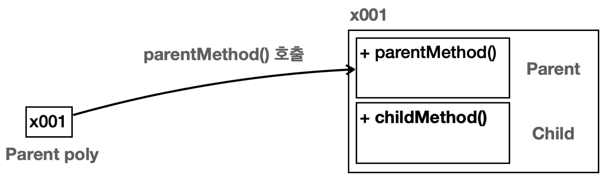
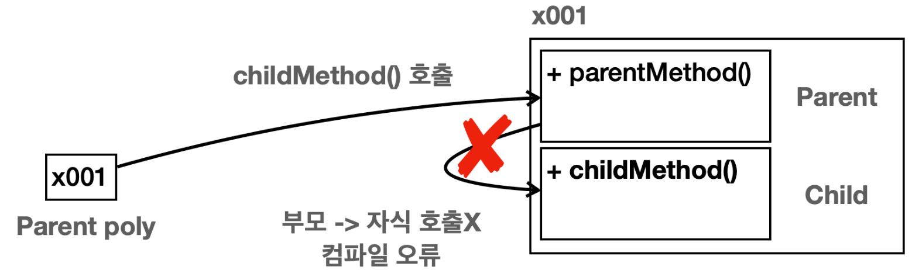
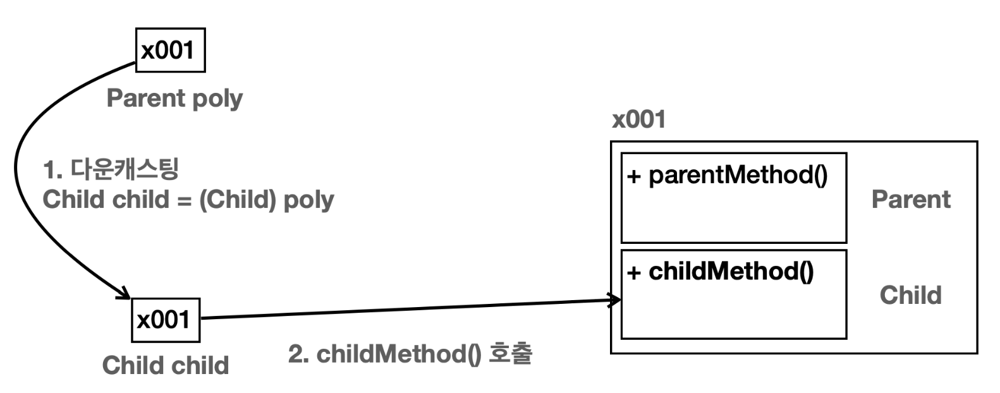

# 다형성 - 1

다형성은 한 객체가 여러 타입의 객체로 취급될 수 있는 능력을 뜻한다.

보통 하나의 객체는 하나의 타입으로 고정되어 있다. 그러나 다형성을 사용하면, 하나의 객체가 다른 타입으로 사용될 수 있다.

**다형성의 핵심 이론**
- 다형성 참조
- 메서드 오버라이딩

## 다형적 참조

```java
package poly.basic;

public class PolyMain {
    public static void main(String[] args) {
    //부모 변수가 부모 인스턴스 참조
        System.out.println("Parent -> Parent");
        Parent parent = new Parent();
        parent.parentMethod();
        //Parent 인스턴스 생성, 메모리 상에 Parent만 생성 (자식은 생성되지 않는다!!)
        //생성된 참조값은 parent 변수에 저장

        //자식 변수가 자식 인스턴스 참조
        System.out.println("Child -> Child");
        Child child = new Child();
        child.parentMethod();
        child.childMethod();
        //메모리 상에 child와 parent가 모두 생성된다.
        //생성된 Child 참조값을 Child타입 변수인 child에 담아준다


        //부모 변수가 자식 인스턴스를 참조하는 경우(다형적 참조)
        System.out.println("Parent -> Child");
        Parent poly = new Child();//부모 타입은 자식을 참조할 수 있다.
        poly.parentMethod();
        
//        Child poly1 = new Parent(); //컴파일 에러
    }
}
```
`Parent poly = new Child();`  



- 변수의 타입에 따라 무엇을 호출할 지 결정
  - `Parent`타입 변수 -> `parentMethod` 찾음
  - 바로 `Parent`부터 찾는다
- 메모리 상에 Child, Parent 둘 다 생성 (Child 인스턴스를 만들었기 때문)
- 생성된 참조값은 Parent 타입 변수인 ploy에 담아둔다.
- 자식의 기능은 호출할 수 없다.
  

`Parent`타입 변수는 자식 타입까지 참조할 수 있다. (그 자식의 자식도 가능)
- `Parent poly = new Parent()`
- `Parent poly = new Child()`
- `Parent poly = new Gardson()` (Child 하위 손자)

> 자바에서 부모 타입은 자신은 물론이고, 자신을 기준으로 하는 모든 자식 타입을 참조할 수 있다.
> 
> 이것이 바로 다양한 형태를 참조할 수 있다 하여 **다형적 참조**라 한다.

### 다형적 참조의 한계

```java
Parent poly = new Child();//부모 타입은 자식을 참조할 수 있다.
poly.childMethod(); 
```
`poly.childMethod()`를 한 경우 어떻게 될까?



- `poly`의 타입에 따라 `Parent` 클래스부터 시작해서 필요한 기능을 찾는다.
- **상속 관계는 부모 방향으로 찾아 올라갈 수는 있지만 자식 방향으로 내려갈 수는 없다.**
- 따라서 `childMethod()`를 찾을 수 없으므로 **컴파일 오류**가 발생한다.

### 다형적 참조의 핵심

**다형적 참조의 핵심은 `부모는 자식을 품을 수 있다`는 것이다.**

## 다형성과 캐스팅
 
상속 관계는 자식에서 부모로만 찾아 올라갈 수 있으므로 `poly.childMethod`는 불가능했다.

### 다운캐스팅
다운캐스팅을 사용하면 자식 타입 변수에 인스턴스의 `Child`에 있는 `childMethod`를 호출할 수 있다.

```java
Child child = (Child) poly; //Parent poly
child.childMethod();
```
`poly`를 `(Child)`를 사용해서 일시적으로 자식 타입인 `Child`타입으로 변경하였다.



**실행 순서**
1. 다운캐스팅을 통해 부모 타입을 자식 타입으로 변환 후 대입 시도  
   `Child child = (Child) poly`
2. 참조값을 읽은 다음 자식 타입으로 지정  
   `Child child = (Child) x001`
3. child에 할당  
   `Child child = x001`

캐스팅을 한다고 해서 `Parent poly` 의 타입이 변하는 것은 아니다.  
해당 **참조값을 꺼내고 꺼낸 참조값이 `Child` 타입이 되는 것**이다.  

따라서 `poly` 의 타입은 `Parent` 로 기존과 같이 유지된다.

### 캐스팅 용어

- `업캐스팅(upcasting)`: 부모 타입으로 변경 
- `다운캐스팅(downcasting)`: 자식 타입으로 변경

### 캐스팅의 종류
