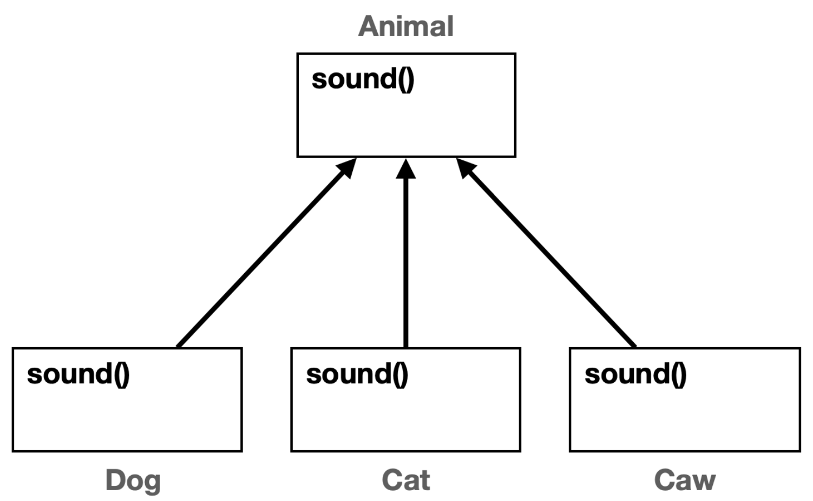

# 다형성 - 2 (다형성 활용)

## 예제 1

```java
package poly.ex1;

public class AnimalSoundMain {
    public static void main(String[] args) {
        Dog dog = new Dog();
        Cat cat = new Cat();
        Cow cow = new Cow();

        System.out.println("동물 소리 테스트 시작");
        dog.sound();
        System.out.println("동물 소리 테스트 종료");
        System.out.println("동물 소리 테스트 시작");
        cat.sound();
        System.out.println("동물 소리 테스트 종료");
        System.out.println("동물 소리 테스트 시작");
        cow.sound();
        System.out.println("동물 소리 테스트 종료");
    }
}
```

### 중복 코드 제거 시도 방법 3가지

1. 메서드로 중복 코드 제거하기
   - 매개변수의 클래스를 `Caw` , `Dog` , `Cat` 중에 하나로 정해야 한다.
   - 즉 의미가 없다..
2. 배열과 for문을 통한 중복 제거하기
   - 배열의 타입을 `Dog` , `Cat` , `Caw` 중에 하나로 지정해야 한다. 
   - 같은 `Caw` 들을 배열에 담아서 처리하는 것은 가능
   - `Dog` , `Cat` , `Caw` 을 하나의 배열에 담는 것은 불가능하다.

> 문제의 핵심 : 타입이 다르다!

`다형적 참조`와 `메서드 오버라이딩`을 활용하여 `Dog`, `Cat`, `Caw`가 모두 같은 타입을 사용하도록 하고, 각자 자신의 메서드도 호출하도록 할 수 있다.

## 예제 2



```java
package poly.ex2;

public class AnimalPolyMain1 {
    public static void main(String[] args) {
        Dog dog = new Dog();
        Cat cat = new Cat();
        Cow cow = new Cow();
        soundAnimal(dog);
        soundAnimal(cat);
        soundAnimal(cow);
    }

    private static void soundAnimal(Animal animal) { //animal에서 셋 모두 받을 수 있음
        System.out.println("동물 소리 테스트 시작");
        animal.sound(); //각 자식에서 오버라이딩 된 결과 출력

        System.out.println("동물 소리 테스트 종료");
    }
}

```

- **다형적 참조**
  - `animal` 변수는 자식인 `Dog` , `Cat` , `Caw` 의 인스턴스를 참조할 수 있다.
- **메서드 오버라이딩**
  - `animal.sound()`를 호출해도 `Dog.sound()`, `Cat.sound()`, `Caw.sound()`와 같이 각 인스턴스의 메서드를 호출할 수 있다.

## 예제 3

다형적 참조와 배열, 반목문을 사용할 수도 있다.

```java
package poly.ex2;

public class AnimalPolyMain2 {
    public static void main(String[] args) {
        Animal[] animalArr = {new Dog(), new Cat(), new Cow(), new Duck()};

        for (Animal animal : animalArr) {
            System.out.println("동물 소리 테스트 시작");
            animal.sound();
            System.out.println("동물 소리 테스트 종료");
        }
    }

}
```

다형적 참조 덕분에 `Animal`타입으로 배열을 만들고, 각각을 배열에 포함했다.    
해당 배열을 for문을 사용해서 반복하였다.

`animal.sound()`를 호출하지만 배열에는 `Dog`, `Cat`, `Caw`의 인스턴스가 들어있다. 메서드 오버라이딩에 의해 각 인스턴스의 오버라이딩 된 `sound()`메서드가 호출된다.

## 남은 문제
- `Animal` 클래스를 생성할 수 있는 문제
  - `Animal` 클래스는 다형성을 위해서 필요한 것이지 직접 인스턴스를 생성해서 사용할 일은 없다.
- `Animal` 클래스를 상속 받는 곳에서 `sound()` 메서드 오버라이딩을 하지 않을 가능성
  - 이 경우 부모 클래스에 있는 `Animal.sound()` 가 호출될 것이다. -> 의도한 바가 아님!!

> 추상 클래스와 추상 메서드를 사용하여 해당 문제들을 해결할 수 있다.

## 추상 클래스

> 부모 클래스는 제공하지만, 실제로 생성되면 안되는 클래스

추상적인 개념은 제공하지만, 실체인 인스턴스가 존재하지 않는다.

상속이 목적인 클래스이고, 부모 클래스 역할을 담당한다.

```java 
abstract class AbstractAnimal {...} 
```
- 클래스를 선언할 때 앞에 추상이라는 의미의 `abstract` 키워드를 붙여주면 된다.
- 추상 클래스는 기존 클래스와 완전히 같다. 다만 `new AbstractAnimal()`와 같이 직접 인스턴스를 생성하지 못하는 제약이 추가된 것이다.

## 추상 메서드

> 자식 클래스가 반드시 오버라이딩 해야 하는 메서드

추상 메서드는 실체가 존재하지 않고, 메서드 바디가 없다.


```java
public abstract void sound(); 
```
- 선언할 때 메서드 앞에 추상이라는 의미의 `abstract` 키워드를 붙여주면 된다.
- **추상 메서드가 하나라도 있는 클래스는 추상 클래스로 선언해야 한다.**
    - 그렇지 않으면 컴파일 오류
    - 추상 메서드가 있는 클래스는 작동하지 않는 메서드를 가진 불완전한 클래스로 볼 수 있다. 따라서 직접 생성하지 못하도록 추상 클래스로 선언해야 한다.
- **추상 메서드는 상속 받는 자식 클래스가 반드시 오버라이딩 해서 사용해야 한다.**
    - 그렇지 않으면 컴파일 오류
    - 추상 메서드는 자식 클래스가 반드시 오버라이딩 해야 하기 때문에 메서드 바디 부분이 없다.
    - 오버라이딩 하지 않으면 자식도 추상 클래스가 되어야 한다.

### 정리

- 추상 클래스 덕분에 실수로 `Animal` 인스턴스를 생성할 문제를 근본적으로 방지해준다.
- 추상 메서드 덕분에 새로운 동물의 자식 클래스를 만들때 실수로 `sound()`를 오버라이딩 하지 않을 문제를 근본적으로 방지해준다.
