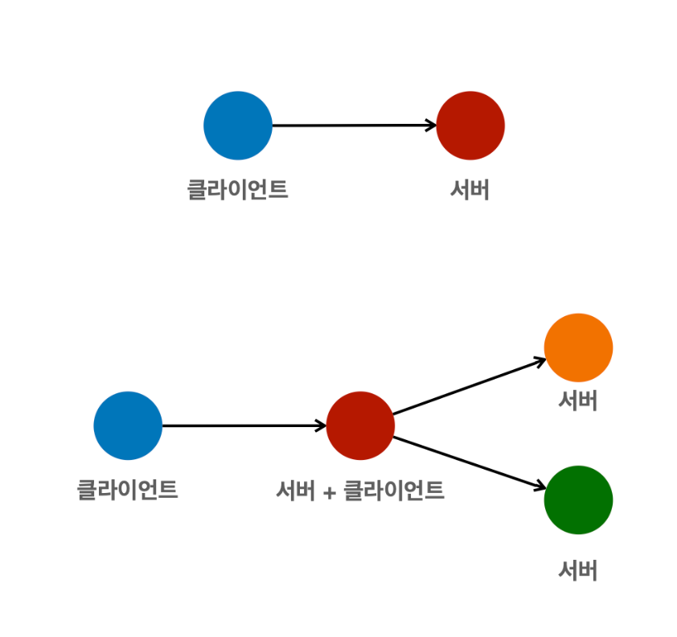
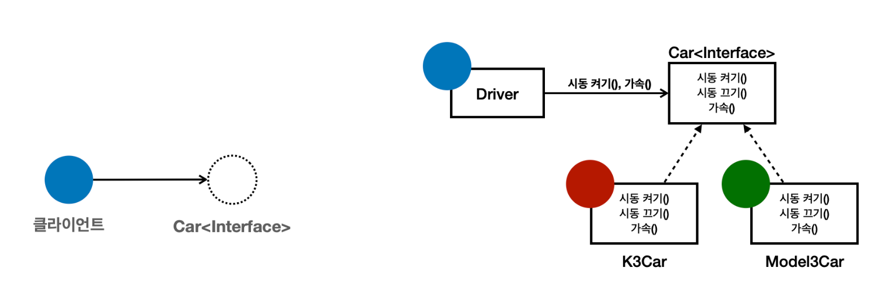
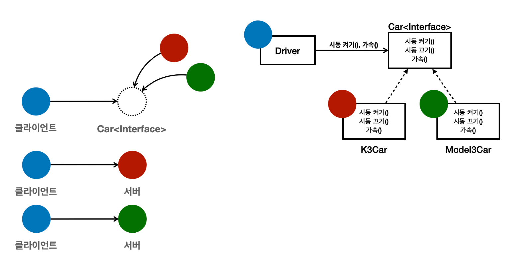
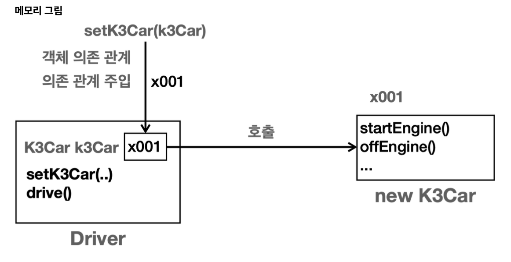
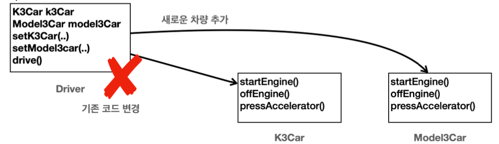
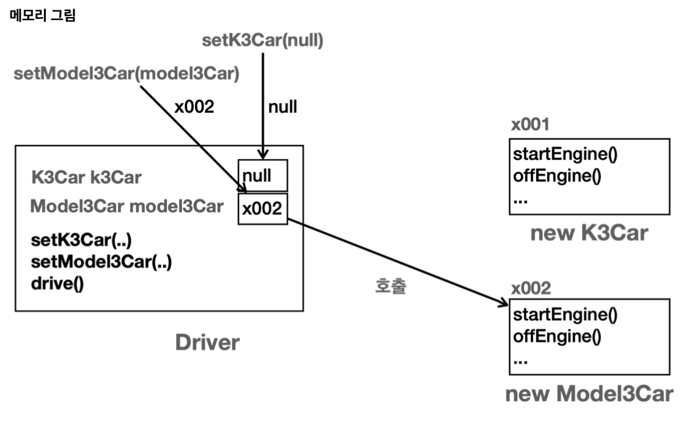
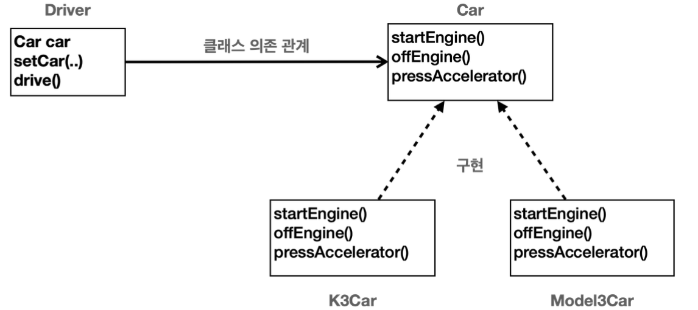
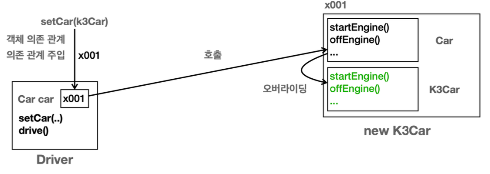

# 좋은 객체 지향 프로그래밍이란?

## 객체 지향의 특징
- 추상화
- 캡슐화
- 상속
- 다형성

## 객체 지향 프로그래밍
- 컴퓨터 프로그램을 명령어의 목록으로 보는 시각에서 벗어나 여러개의 독립된 단위, 즉 **객체들의 모임**으로 파악하고자 하는 것이다. 
- 각각의 객체는 메세지를 주고받고, 데이터를 처리할 수 있다.
- 프로그램을 **유연**하고 **변경이 용이**하게 만들기 때문에 대규모 프로젝트 개발에 많이 사용된다.

### 다형성의 실세계 비유
- 실세계와 객체 지향을 1:1로 매칭 X
- **역할과 구현**으로 세상을 구분한다.

#### 예시

> 운전자(역할)와 자동차(역할)

자동차 역할의 인터페이스를 따라서 다양한 자동차 종류를 구현할 수 있다.

자동차의 **_역할 / 구현을 분리하였다._**

클라이언트(운전자 역할) 자동차의 모든 동작 방식을 이해할 필요는 없다.  
단지 자동차의 역할을 알고 사용할 수 있으면 된다.

자동차의 내부 구현 방식에 변화가 생겨도 클라이언트는 영향을 받지 않는다.

즉, 클라이언트는 대상의 역할(인터페이스)만 알면 된다.

클라이언트는 구현 대상 자체를 변경해도 영향받지 않는다.

# 역할과 구현을 분리 - 자바 언어
- 자바 언어의 다형성을 활용
  - 역할 = 인터페이스
  - 구현 = 인터페이스를 구현한 클래스, 구현 객체
- 객체를 설계할 때 역할과 구현을 명확히 분리
- 객체 설계 시 역할(인터페이스)를 먼저 부여하고, 그 역할을 수행하는 구현 객체 만들기





다형성으로 인터페이스를 구현한 객체 => Car 인터페이스 사용



자식인 객체만 담아서 사용할 수 있다.

클라이언트는 인터페이스로만 호출했지만 자식에 오버라이딩 된 메서드를 호출해 사용할 수 있다.

## 다형성의 본질

- 인터페이스를 구현한 객체 인스턴스를 **실행 시점에 유연하게 변경할 수 있다.**
- **클라이언트를 변경하지 않고, 서버의 구현 기능을 유연하게 변경할 수 있다.**

## 정리

- 실세계의 역할과 구현이라는 편리한 컨셉을 다형성을 통해 객체 세상으로 가져올 수 있음
- 유연하고, 변경 용이
- 확장 가능한 설계
- 클라이언트에게 영향을 주지 않는 변경 기능
- 인터페이스를 안정적으로 설계하는 것이 중요

## 한계

- 역할(인터페이스) 자체가 변하면, 클라이언트, 서버 모두에 큰 변경이 발생한다.
  - 인터페이스를 안정적으로 잘 설게하는 것이 중요하다 !!
  - 나아가 api 설계 시에도 변경을 적게 하기 위해 안정적 설계가 중요

# 정리

- 다형성이 가장 중요하다!
- 디자인 패턴 대부분은 다형성을 활용하는 것이다.
- 스프링의 핵심인 제어의 역전(IoC), 의존관계 주입(DI)도 결국 다형성을 활용하는 것이다.
- 다형성을 잘 활용하면 마치 레고 블럭 조립하듯이 구현을 편리하게 변경할 수 있다.

# 다형성 - 역할과 구현 예제 1

```java
package poly.car0;

public class CarMain0 {
    public static void main(String[] args) {
        Driver driver = new Driver();
        K3Car k3Car = new K3Car();

        driver.setK3Car(k3Car); //참조형 변수에 생성된 K3Car 객체 주소 넣기 -> 운전자가 실제 차를 가짐
        driver.drive(); //K3Car의 메서드를 사용해 운전함 (기능을 사용함)
    }
}
```



# 다형성 - 역할과 구현 예제2

같은 기능을 가진 Model3Car 추가됨

```java
package poly.car0;

public class Driver {
  private K3Car k3Car; //참조형 기본 값 null
  private Model3Car model3Car;

  public void setK3Car(K3Car k3Car) {
    this.k3Car = k3Car;
  }

  public void setModel3Car(Model3Car model3Car) {
    this.model3Car = model3Car;
  }

  public void drive() {
    System.out.println("자동차를 운전합니다.");
    if(k3Car != null) {
      k3Car.startEngine();
      k3Car.pressAccelerator();
      k3Car.offEngine();
    }
    else if(model3Car != null){
      model3Car.startEngine();
      model3Car.pressAccelerator();
      model3Car.offEngine();
    }
  }
}
```





main에서 사용 시 `Driver` 메서드 사용전 필드의 나머지 차 참조변수를 `null`로 바꿔주고 사용해야 한다.

여기서 새로운 차량을 추가한다면 또 다시 `Driver` 메서드 코드를 변경해야 한다.  
운전자의 메서드 코드를 매번 바꿔줘야 한다. **(클라이언트가 영향을 받는다. -> 역할과 구현을 분리하지 않았기 때문이다.)**

# 다형성 - 역할과 구현 예제3
다형성을 사용하면 클라이언트 코드의 변경 없이 구현 객체를 변경할 수 있다.



- `Driver` : 운전자는 자동차(`Car`)의 역할에만 의존한다. **구현인 `K3`, `Model3` 자동차에 의존하지 않는다.**
  - `Driver` 클래스는 `Car car`라는 멤버 변수를 가진다. (`Car`인터페이스 참조)
  - 인터페이스를 구현한 `K3`, `Model3`에 의존하지 않는다.
- `클래스 의존 관계` : 클래스 상에서 어떤 클래스를 알고 있는가를 뜻한다.
  - 예제에서는 `Driver` 클래스는 `Car` 인터페이스만 사용하므로 `Car`와 클래스 의존 관계이다.

```java
package poly.car1;

public class Driver {
    //Dirver는 K3, Model3를 모른다.
    //Car만 사용
    private Car car;

    public void setCar(Car car) {
        System.out.println("자동차를 설정합니다 : " + car);
        this.car = car;
    }

    public void drive(){
        System.out.println("자동차를 운전합니다");
        car.startEngine();
        car.pressAccelerator();
        car.offEngine();
    }
}
```

```java
package poly.car1;

public class CarMain1 {
    public static void main(String[] args) {
        Driver driver = new Driver();

        //차 선택
        K3Car k3Car = new K3Car();
        driver.setCar(k3Car);
        //사용
        driver.drive();

        Model3Car model3Car = new Model3Car();
        driver.setCar(model3Car);
        driver.drive();
    }
}
```

```text
자동차를 설정합니다 : poly.car1.K3Car@452b3a41
자동차를 운전합니다
K3Car.startEngine
K3Car.pressAccelerator
K3Car.offEngine
자동차를 설정합니다 : poly.car1.Model3Car@f6f4d33
자동차를 운전합니다
Model3Car.startEngine
Model3Car.pressAccelerator
Model3Car.offEngine
```



`Car` 타입이니까 먼저 `Car`로 가고 **메서드 오버라이딩**에 의해 `K3Car`의 기능이 호출된다.

이후 `Model3Car`를 참조하게 되면 `K3Car`와는 참조가 끊긴다.

