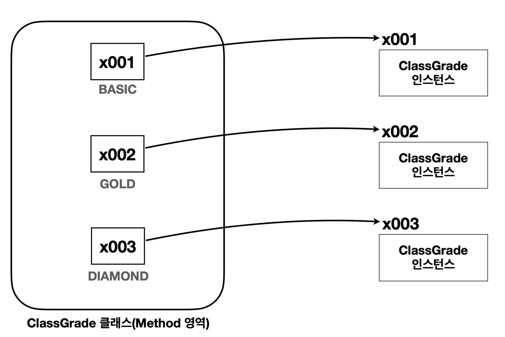
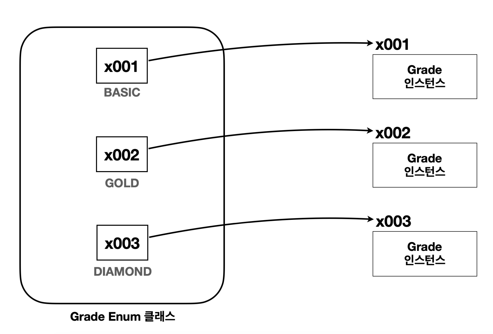

# 문자열과 타입 안전성
자바가 제공하는 열거형(Enum Type)을 제대로 이해하려면 먼저 열거형이 생겨난 이유를 알아야 한다. 

## String 사용 시 타입 안정성 부족 문제
- 값의 제한 부족
  - 문자열은 오타가 발생하기 쉽고, 유효하지 않은 값이 입력될 수 있다.
- 컴파일 시 오류 감지 불가
  - "GOLD", "gold", "Gold" 등 다양한 형식으로 문자열을 입력할 수 있어 일관성이 떨어진다.

이런 문제를 해결하려면 특정 범위로 값을 제한해야 한다. 

> 문자열 상수를 사용해도, 지금까지 발생한 문제들을 근본적으로 해결할 수는 없다.  
> `String` 타입은 어떤 문자열이든 입력할 수 있기 때문이다.

# 타입 안전 열거형 패턴

**타입 안전 열거형 패턴 - Type-Safe Enum Pattern**

- `enum` 은 `enumeration` 의 줄임말

> 타입 안전 열거형 패턴을 사용하면 이렇게 나열한 항목만 사용할 수 있다
> 나열한 항목이 아닌 것은 사용할 수 없다. 
> 
> -> 즉, 안전성 증가

```java
package enumeration.ex2;

public class ClassGrade {
    public static final ClassGrade BASIC = new ClassGrade();
    public static final ClassGrade GOLD = new ClassGrade();
    public static final ClassGrade DIAMOND = new ClassGrade();
    //등급별 상수 선언(static + final)
    //각각의 상수마다 별도의 인스턴스 생성, 생성한 인스턴스 댑입
}
```

```java
package enumeration.ex2;

public class ClassRefMain {
    public static void main(String[] args) {
        System.out.println("class BASIC = " + ClassGrade.BASIC.getClass());
        System.out.println("class GOLD = " + ClassGrade.GOLD.getClass());
        System.out.println("class DIAMOND = " + ClassGrade.DIAMOND.getClass());
        //모두 ClassGradedlek.

        System.out.println("ref BASIC = " + ClassGrade.BASIC);
        System.out.println("ref GOLD = " + ClassGrade.GOLD);
        System.out.println("ref DIAMOND = " + ClassGrade.DIAMOND);
        //서로 다른 참조값ㅇ르 가진다.
    }
}
```


여기서 `BASIC` , `GOLD` , `DIAMOND` 를 상수로 열거했다. 이제 `ClassGrade` 타입을 사용할 때는 앞서 열거한 상수들만 사용하면 된다.

```java
package enumeration.ex2;

import enumeration.ex1.StringGrade;

public class DiscountService {
    //문자를 받는 대신 classGrade라는 타입을 받는다. 
    public int discount(ClassGrade classGrade, int price) {
        int discountPercent = 0;

        if(classGrade == ClassGrade.BASIC) {
            discountPercent = 10;
        } else if (classGrade == ClassGrade.GOLD) {
            discountPercent = 20;
        } else if (classGrade == ClassGrade.DIAMOND) {
            discountPercent = 30;
        } else {
            System.out.println("할인 x");
        }

        //10000 * (20 / 100) -> 2000원 할인
        return price * discountPercent / 100;
    }
}
```
- `discount()` 메서드는 매개변수로 `ClassGrade` 클래스를 사용한다.
- 값을 비교할 때는 `classGrade == ClassGrade.BASIC` 와 같이 `==` **참조값 비교**를 사용하면 된다. 매개변수에 넘어오는 인수도 `ClassGrade` 가 가진 상수 중에 하나를 사용한다. 
- 따라서 열거한 상수의 참조값으로 비교( `==` )하면 된다.


```java
package enumeration.ex2;

public class ClassGradeEx2_2 {
    public static void main(String[] args) {
        int price = 10000;

        DiscountService discountService = new DiscountService();
//        ClassGrade newClassGrade = new ClassGrade(); // x009 //생성자를 private으로 바꿔서 생성 ㅁ가기
//        int result = discountService.discount(newClassGrade, price);
//        System.out.println("newClassGrade 등급의 할인 금액 : " + newClassGrade);

    }
}
```
외부에서 임의로 `ClassGrade` 의 인스턴스를 생성할 수 있다는 문제를 막아야 한다.

생성자를 `private`으로 선언하면 막을 수 있다.

- `private` 생성자를 사용해서 외부에서 `ClassGrade` 를 임의로 생성하지 못하게 막았다.
  - `ClassGrade` 의 인스턴스를 생성하는 것은 `ClassGrade` 클래스 내부에서만 할 수 있다. 
  - 앞서 정의한 상수들은 `ClassGrade` 클래스 내부에서 `ClassGrade` 객체를 생성한다.
- 이제 `ClassGrade` 인스턴스를 사용할 때는 `ClassGrade` 내부에 정의한 상수를 사용해야 한다. 그렇지 않으면 컴파일 오류가 발생한다.
  - `ClassGrade` 타입에 값을 전달할 때는 앞서 열거한 `BASIC` , `GOLD` , `DIAMOND` 상수만 사용할 수 있다.

## 장점

> 타입 안전 열거형 패턴(Type-Safe Enum Pattern)의 장점
> - **타입 안정성 향상**: 정해진 객체만 사용할 수 있기 때문에, 잘못된 값을 입력하는 문제를 근본적으로 방지할 수 있다.
> - **데이터 일관성**: 정해진 객체만 사용하므로 데이터의 일관성이 보장된다.
> - **제한된 인스턴스 생성**: 클래스는 사전에 정의된 몇 개의 인스턴스만 생성하고, 외부에서는 이 인스턴스들만 사용 할 수 있도록 한다.  
> - **타입 안전성**: 이 패턴을 사용하면, 잘못된 값이 할당되거나 사용되는 것을 컴파일 시점에 방지할 수 있다.


## 단점
이 패턴을 구현하려면 많은 코드를 작성해야 한다. 그리고 `private` 생성자를 추가하는 등 유의해야 하는 부분들도 있다.

# 열거형 - Enum Type
자바는 **타입 안전 열거형 패턴(Type-Safe Enum Pattern)** 을 매우 편리하게 사용할 수 있는 열거형(Enum Type)을 제공한다.

자바의 `enum`은 타입 안전성을 제공하고, 코드의 가독성을 높이며, 예상 가능한 값들의 집합을 표현하는 데 사용된다.

```java
package enumeration.ex3;

public enum Grade {
    BASIC, GOLD, DIAMOND
}
```
}

- 열거형을 정의할 때는 `class` 대신에 `enum` 을 사용한다. 
- 원하는 상수의 이름을 나열하면 된다.


```java
 public class Grade extends Enum {
     public static final Grade BASIC = new Grade();
     public static final Grade GOLD = new Grade();
     public static final Grade DIAMOND = new Grade();
//private 생성자 추가
     private Grade() {}
}
```
이 코드와 거의 같다.
- 열거형도 클래스이다.
- 열거형은 자동으로 `java.lang.Enum` 을 상속 받는다. 
- 외부에서 임의로 생성할 수 없다.




```java
package enumeration.ex3;

public class EnumRefMain {
    public static void main(String[] args) {
        System.out.println("class BASIC = " + Grade.BASIC.getClass());
        System.out.println("class GOLD = " + Grade.GOLD.getClass());
        System.out.println("class DIAMOND = " + Grade.DIAMOND.getClass());

        System.out.println("ref BASIC = " +refValue(Grade.BASIC));
        System.out.println("ref GOLD = " +refValue(Grade.GOLD));
        System.out.println("ref DIAMOND = " +refValue(Grade.DIAMOND));
    }

    private static String refValue (Object grade) {
        return Integer.toHexString(System.identityHashCode(grade));
    }
}
```

- 상수들이 열거형으로 선언한 타입인 `Grade` 타입을 사용하는 것을 확인할 수 있다. 그리고 각 각의 인스턴스도 서로 다른 것을 확인할 수 있다.
- 참고로 열거형은 `toString()`을 재정의 하기 때문에 참조값을 직접 확인할 수 없다. 참조값을 구하기 위해 `refValue()` 를 만들었다.
  - `System.identityHashCode(grade)` : 자바가 관리하는 객체의 참조값을 숫자로 반환한다. 
  - `Integer.toHexString()` : 숫자를 16진수로 변환, 우리가 일반적으로 확인하는 참조값은 16진수
- 열거형도 클래스이다. 열거형을 제공하기 위해 제약이 추가된 클래스라 생각하면 된다.


- `enum`은 열거형 내부에서 상수로 지정하는 것 외에 직접 생성이 불가능하다. 생성할 경우 컴파일 오류
  - 오류 메시지: `enum classes may not be instantiated`

**열거형(ENUM)의 장점**
- **타입 안정성 향상**: 열거형은 사전에 정의된 상수들로만 구성되므로, 유효하지 않은 값이 입력될 가능성이 없다. 
- **간결성 및 일관성**: 열거형을 사용하면 코드가 더 간결하고 명확해지며, 데이터의 일관성이 보장된다.
- **확장성**: 새로운 회원 등급을 타입을 추가하고 싶을 때, `ENUM`에 새로운 상수를 추가하기만 하면 된다.  


> **참고**  
열거형을 사용하는 경우 `static import` 를 적절하게 사용하면 더 읽기 좋은 코드를 만들 수 있다.
> ```java
> import static enumeration.ex3.Grade.*; //상수는 static import 가능
> 
> ... BASIC, GOLD 그냥 사용 가능
> ```

## 주요 메서드
모든 열거형은 `java.lang.Enum` 클래스를 자동으로 상속 받는다. 따라서 해당 클래스가 제공하는 기능들을 사용할 수 있다.

```java
package enumeration.ex3;

import java.util.Arrays;

public class EnumMethodMain {
    public static void main(String[] args) {
        Grade[] values = Grade.values(); //모든 상수 학목 배열로 받을 수 있음

        // 모든 enum 반환
        System.out.println("values = " + Arrays.toString(values));

        for (Grade value : values) {
            System.out.println("value.name() = " + value.name() + ", ordinal = " + value.ordinal()); //순서도 가능
        }

        //String -> enum 변환, 잘못된 문자면 IllegalArgumentException 예외 발생
        String input = "GOLD";
        Grade gold = Grade.valueOf(input);
        System.out.println("gold = " + gold); //toString 오버라이딩 가능
    }
}
```
`Arrays.toString()` 배열의 참조값이 아니라 배열 내부의 값을 출력할 때 사용한다.


**ENUM - 주요 메서드**

- **values()**: 모든 ENUM 상수를 포함하는 배열을 반환한다.
- **valueOf(String name)**: 주어진 이름과 일치하는 ENUM 상수를 반환한다.
- **name()**: ENUM 상수의 이름을 문자열로 반환한다.
- **ordinal()**: ENUM 상수의 선언 순서(0부터 시작)를 반환한다.
- **toString()**: ENUM 상수의 이름을 문자열로 반환한다. `name()` 메서드와 유사하지만, `toString()` 은 직접 오버라이드 할 수 있다.

> **주의 ordinal()은 가급적 사용하지 않는 것이 좋다.**  
이 값을 사용하다가 중간에 상수를 선언하는 위치가 변경되면 전체 상수의 위치가 모두 변경될 수 있기 때문이다.
예를 들어 중간에 `BASIC` 다음에 `SILVER` 등급이 추가되는 경우 `GOLD` , `DIAMOND` 의 값이 하나씩 추가된다.


**열거형 정리**
1. 열거형은 `java.lang.Enum` 를 자동(강제)으로 상속 받는다.
2. 열거형은 이미 `java.lang.Enum` 을 상속 받았기 때문에 추가로 다른 클래스를 상속을 받을 수 없다. 열거형은 인터페이스를 구현할 수 있다.
3. 열거형에 추상 메서드를 선언하고, 구현할 수 있다.
   1. 이 경우 익명 클래스와 같은 방식을 사용한다. 익명 클래스는 뒤에서 다룬다.