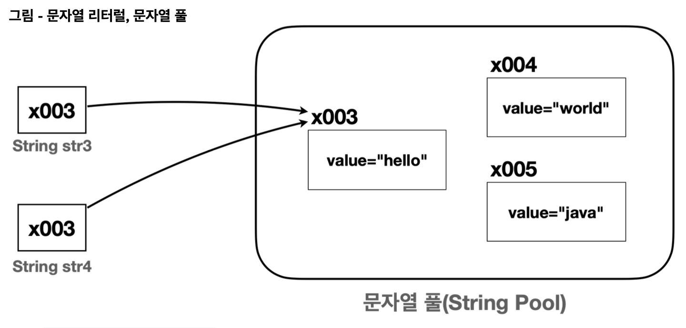

# String 클래스

## 기본

자바에서 문자를 다루는 타입
- `char`
  - 문자 하나
  - 문자를 나열하려면 `char[]`을 사용함 -> 불편
- `String`
  - 문자열
  - 사실 클래스다

`String` 은 클래스다. `int` , `boolean` 같은 기본형이 아니라 참조형이다.  
따라서 `str1` 변수에는 `String` 인스턴 스의 참조값만 들어갈 수 있다.


문자열은 매우 자주 사용된다. 그래서 편의상 쌍따옴표로 문자열을 감싸면 자바 언어에서 `new String("hello")` 와 같이 변경해준다. (이 경우 실제로는 성능 최적화를 위해 문자열 풀을 사용)
```java
String str1 = "hello"; //기존
String str1 = new String("hello"); //변경
```

## String 클래스 구조

```java
public final class String {
    //문자열 보관
    private final char[] value;// 자바 9 이전 
    private final byte[] value;// 자바 9 이후
    //여러 메서드
    public String concat(String str) {...} public int length() {...}
    ...
}
```

문제 데이터 자체는 배열 필드에 저장이 된다.

개발자가 직접 다루기 불편한 `char[]` 을 내부에 감추고 `String` 클래스를 사용하는 개발자가 편리하게 문자열을 다룰 수 있는 수 있도록 다양한 기능을 제공한다. 

메서드 제공을 넘어서 자바 언어 차원에서도 여러 편의 문법을 제공한다.

> **참고: 자바 9 이후 String 클래스 변경 사항**
자바 9부터 `String` 클래스에서 `char[]` 대신에 `byte[]` 을 사용한다.
> ```java
> private final byte[] value;
> ```
> 자바에서 문자 하나를 표현하는 `char` 는 `2byte` 를 차지한다. 
> 영어, 숫자는 보통 `1byte` 로 표현이 가능하다. 
> 
> 단순 영어, 숫자로만 표현된 경우 `1byte` 를 사용하고(정확히는 Latin-1 인코딩의 경우 `1byte` 사용), 
> 그렇지 않은 나머지의 경우 `2byte` 인 UTF-16 인코딩을 사용한다. 따라서 메모리를 더 효율적으로 사용할 수 있게 변경되었다.

### 기능 (메서드)

`String` 클래스는 문자열로 처리할 수 있는 다양한 기능을 제공한다. 

- `length()` : 문자열의 길이를 반환한다.
- `charAt(int index)` : 특정 인덱스의 문자를 반환한다.
- `substring(int beginIndex, int endIndex)` : 문자열의 부분 문자열을 반환한다. 
- `indexOf(String str)` : 특정 문자열이 시작되는 인덱스를 반환한다.
- `toLowerCase()` , `toUpperCase()` : 문자열을 소문자 또는 대문자로 변환한다. 
- `trim()` : 문자열 양 끝의 공백을 제거한다.
- `concat(String str)` : 문자열을 더한다.

## String 클래스와 참조형
`String` 은 클래스이다. 따라서 기본형이 아니라 참조형이다.
참조형은 변수에 계산할 수 있는 값이 들어있는 것이 아니라 `x001`과 같이 계산할 수 없는 참조값이 들어있다.   
따라서 원칙적으로 `+` 같은 연산을 사용할 수 없다.

-> 근데 너무 자주 쓰여서 `+` 연산 해도 `concat()` 메서드 사용한 것처럼 연산해줌


## 비교


`String` 클래스 비교할 때는 `==` 비교가 아니라 항상 `equals()` 비교를 해야한다.
- **동일성(Identity)**: `==` 연산자를 사용해서 두 객체의 참조가 동일한 객체를 가리키고 있는지 확인 
- **동등성(Equality)**: `equals()` 메서드를 사용하여 두 객체가 논리적으로 같은지 확인

```java
package lang.String.equals;

public class StringEqualsMain1 {
    public static void main(String[] args) {
        String str1 = new String("hello");
        String str2 = new String("hello");

        System.out.println("new String() == 비교 " + (str1 == str2)); //false
        System.out.println("new String() equals 비교 " + (str1.equals(str2))); //true

        String str3 ="hello"; //x003
        String str4 = "hello"; //x004
        System.out.println("new String() == 비교 " + (str3 == str4)); //true 
        System.out.println("new String() equals 비교 " + (str1.equals(str2))); //true
    }
}
```
- `String` 클래스는 내부 문자열 값을 비교하도록 `equals()` 메서드를 재정의 해두었다. (결과가 true인 이유)



- `String str3 = "hello"` 와 같이 문자열 리터럴을 사용하는 경우 자바는 메모리 효율성과 성능 최적화를 위해 문자열 풀을 사용한다.
- 자바가 실행되는 시점에 클래스에 문자열 리터럴이 있으면 문자열 풀에 `String` 인스턴스를 미리 만들어둔다. 이때 같은 문자열이 있으면 만들지 않는다.
- `String str3 = "hello"` 와 같이 문자열 리터럴을 사용하면 문자열 풀에서 `"hello"` 라는 문자를 가진 `String` 인스턴스를 찾는다. 그리고 찾은 인스턴스의 참조( `x003` )를 반환한다.
  - `String str4 = "hello"` 의 경우 `"hello"` 문자열 리터럴을 사용하므로 문자열 풀에서 `str3` 과 같은 `x003` 참조를 사용한다. 
  - 따라서 `==` 비교 결과는 **true**

> 문자열 풀 덕분에 같은 문자를 사용하는 경우 메모리 사용을 줄이고 문자를 만드는 시간도 줄어들기 때문에 성능도 최적화 할 수 있다.

> **참고**: 풀(Pool)은 자원이 모여있는 곳을 의미한다.   
> 프로그래밍에서 풀(Pool)은 공용 자원을 모아둔 곳을 뜻한다. 여러 곳에서 함께 사용할 수 있는 객체를 필요할 때 마다 생성하고, 제거하는 것은 비효율적이다.   
> 대신에 이렇게 문자열 풀에 필요한 `String` 인스턴스를 미리 만들어두고 여러곳에서 재사용할 수 있다면 성능과 메모리를 더 최적화 할 수 있다.
참고로 문자열 풀은 힙 영역을 사용한다. 그리고 문자열 풀에서 문자를 찾을 때는 해시 알고리즘을 사용하기 때문 에 매우 빠른 속도로 원하는 `String` 인스턴스를 찾을 수 있다.

### 문자열 비교는 항상 `equals()` 를 사용해서 동등성 비교를 해야 한다.

런타임에서 매개변수로 넘어오는 `String` 인스턴스가 `new String()` 으로 만들어진 것인지, 문자열 리터럴로 만들어 진 것인지 확인할 수 있는 방법이 없다.

## 불변 객체

`String` 은 불변 객체이다. 따라서 생성 이후에 **절대로** 내부의 문자열 값을 변경할 수 없다.
(`private final byte[] value;`)

```java
package lang.String.immutable;

public class StringImmutable2 {
    public static void main(String[] args) {
        String str = "hello";
        String str2 = str.concat("java"); 
        //불변 객체이므로... 새로운 String 객체를 만들어서 반환

        System.out.println("str = " + str2);
        // str가 가리키는 값은 그대로
    }
}
```