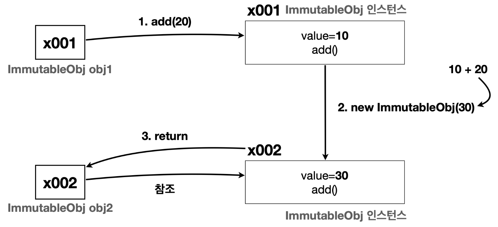

# 기본형과 참조형의 공유

자바의 데이터 타입을 가장 크게 보면 기본형(Primitive Type)과 참조형(Reference Type)으로 나눌 수 있다.   
- **기본형**: 하나의 값을 여러 변수에서 절대로 공유하지 않는다.
- **참조형**: 하나의 객체를 참조값을 통해 여러 변수에서 공유할 수 있다.

```java
package lang.immutable.address;

public class PrimitiveMain {
    public static void main(String[] args) {
        //기본형은 절대로 같은 값을 공유하지 않는다.
        int a = 10;
        int b = a; //a -> b, 값 복사 후 대입
        System.out.println("a = " + a);
        System.out.println("b = " + b);

        b = 20;
        System.out.println("20 -> b");
        System.out.println("a = " + a);
        System.out.println("b = " + b);
    }
}
```
- 기본형 변수 `a` 와 `b` 는 절대로 하나의 값을 공유하지 않는다.
- `b = a` 라고 하면 **자바는 항상 값을 복사해서 대입** 한다. (`a`의 `10` 을 복사해서 `b` 에 전달)
- 결과적으로 `a` 와 `b` 는 둘다 `10` 이라는 똑같은 숫자의 값을 가진다. 
  - 하지만 `a`의 `10`과 `b`의 `10` 은 **복사된 완전히 다른 `10`** 
  - 메모리상에서도 `a`의 `10`과 `b`의 `10` 은 각각 별도로 존재한다.


```java
package lang.immutable.address;

public class RefMain_1 {
    public static void main(String[] args) {
        //참조형 변수는 하나의 인스턴스를 공유할 수 있다.
        Address a = new Address("서울");
        Address b = a;
        System.out.println("a = " + a);
        System.out.println("b = " + b);

        b.setValue("부산"); //b의 값을 부산으로 변경해야 함
        System.out.println("부산 -> b");
        System.out.println("a = " + a);
        System.out.println("b = " + b);
    }
}
```    


- 참조형 변수들은 같은 참조값을 통해 같은 인스턴스를 참조할 수 있다. 
- `b = a` 라고 하면 `a` 에 있는 참조값 `x001` 을 복사해서 `b` 에 전달한다. 
- 참조값을 복사해서 전달하므로 결과적으로 `a`, `b` 는 같은 `x001` 인스턴스를 참조한다.
- 참조형 변수는 참조값을 통해 같은 객체(인스턴스)를 공유할 수 있다.

# 공유 참조와 사이드 이펙트

`사이드 이펙트(Side Effect)` : 프로그래밍에서 어떤 계산이 주된 작업 외에 추가적인 부수 효과를 일으키는 것  
-> 디버깅이 어려워지고 코드의 안정성이 저하될 수 있다.

```java
b.setValue("부산"); //b의 값을 부산으로 변경해야 함
System.out.println("부산 -> b");
System.out.println("a = " + a); //같은 인스턴스를 참조하므로 사이드 이펙트 발생
System.out.println("b = " + b);
```

## 사이드 이펙트 해결 방안

`a`와 `b`가 서로 다른 인스턴스를 참조하도록 코드를 변경

## 여러 변수가 하나의 객체를 공유하는 것을 막을 방법은 없다

여러 변수가 하나의 객체를 공유하지 않으면 지금까지 설명한 문제들이 발생하지 않는다.  
그런데 여기서 문제가 있다. 하나의 객체를 여러 변수가 공유하지 않도록 강제로 막을 수 있는 방법이 없다는 것이다. 

  

```java
Address a = new Address("서울");
Address b = a; //참조값 대입을 막을 수 있는 방법이 없다.
```
`Address` 를 사용하는 개발자 입장에서 실수로 `b = a` 라고 해도 아무런 오류가 발생하지 않는다.  
왜냐하면 자바 문법상 `Address b = a` 와 같은 참조형 변수의 대입은 아무런 문제가 없기 때문이다.

다음과 같이 새로운 객체를 참조형 변수에 대입하든, 또는 기존 객체를 참조형 변수에 대입하든, 다음 두 코드 모두 자바 문법상 정상인 코드이다.
```java
Address b = new Address("서울") //새로운 객체 참조 Address b = a //기존 객체 공유 참조
```
참조값을 다른 변수에 대입하는 순간 여러 변수가 하나의 객체를 공유하게 된다. 

쉽게 이야기해서 **객체의 공유를 막을 수 있는 방법이 없다!**

기본형은 값이 절대로 공유되지 않지만, 참조형의 경우 자바 문법 상 오류가 없으므로 의도치 않은 사이드 이펙트가 생길 때도 있다.

# 불변 객체

## 도입

객체의 공유를 막을 수 있는 방법은 없다.  
그런데 사이드 이펙트의 더 근본적인 원인을 고려해보면, 객체를 공유하는 것 자체는 문제가 아니다.   
**문제의 직접적인 원인은 공유된 객체의 값을 변경한 것에 있다.**

> 만약 공유된 객체의 값을 변경하지 못하게 설계했다면 이런 사이드 이펙트 자체가 발생하지 않을 것이다.
> 
> 어떻게든 필드 값을 변경할 수 없게 객체를 설계하면 된다.

```java
package lang.immutable.address;

public class ImmutableAddress {
    private final String value; //final로 설정

    public ImmutableAddress(String value) {
        this.value = value;
    }

    public String getValue() {
        return value;
    }

    //setter 없애버림

    @Override
    public String toString() {
        return "Address{" +
                "value='" + value + '\'' +
                '}';
    }
}
```

```java
package lang.immutable.address;

public class RefMain2 {
    public static void main(String[] args) {
        ImmutableAddress a = new ImmutableAddress("서울");
        ImmutableAddress b = a; //참조값 대입을 막을 수 있는 방법이 없다.
        System.out.println("a = " + a);
        System.out.println("b = " + b);
        //b.setValue("부산"); //컴파일 오류 발생
        b = new ImmutableAddress("부산");
        System.out.println("부산 -> b");
        System.out.println("a = " + a);
        System.out.println("b = " + b);
    }
}
```

### 정리
**불변이라는 단순한 제약을 사용해서 사이드 이펙트라는 큰 문제를 막을 수 있다.**  
1. 객체의 공유 참조는 막을 수 없다. 그래서 객체의 값을 변경하면 다른 곳에서 참조하는 변수의 값도 함께 변경되는 사이드 이펙트가 발생한다. 
   1. 사이드 이펙트가 발생하면 안되는 상황이라면  
   -> 불변 객체를 만들어서 사용하면 된다. 불변 객체는 값을 변경할 수 없기 때문에 사이드 이펙트가 원천 차단된다.

2. 불변 객체의 값을 변경하고 싶다면 변경하고 싶은 값으로 새로운 불변 객체를 생성해야 한다. 이렇게 하면 기존 변수들이 참조하는 값에는 영향을 주지 않는다.  

**참고 - 가변(Mutable) 객체 vs 불변(Immutable) 객체**  
- 가변
  - 처음 만든 이후 상태가 변할 수 있다
  - `Address` 는 가변 클래스이다. 이 클래스로 객체를 생성하면 가변 객체가 된다. 
  - 하나를 바꿨을 때 같이 바뀌는 상황이라면 가변 사용

- 불변
  - 처음 만든 이후 상태가 변하지 않는다
  - `ImmutableAddress` 는 불변 클래스이다. 이 클래스로 객체를 생성하면 불변 객체가 된다.

## 값 변경

그래도 값을 변경해야 하는 메서드가 필요하면 어떻게 해야할까?

```java
package lang.immutable.change;

public class ImmutableObj {
    private final int value;

    public ImmutableObj(int value) {
        this.value = value;
    }

    public int getValue() {
        return value;
    }

    public ImmutableObj add (int addValue) {
//        return new ImmutableObj(value + addValue);
        
        int result = value + addValue;
        return new ImmutableObj(result);
        //숫자를 더한 결과를 가지는 새로운 불변객체를 리턴한다.
    }
}
```

**불변 객체의 `add()` 메서드 구현 방법**
- 불변 객체는 값을 변경하면 안된다! 그러면 이미 불변 객체가 아니다!
- 불변 객체는 기존 값은 변경하지 않고 대신에 계산 결과를 바탕으로 새로운 객체를 만들어서 반환한다. 
- 이렇게 하면 불변도 유지하면서 새로운 결과도 만들 수 있다.

```java
package lang.immutable.change;

public class ImmutableMain1 {
    public static void main(String[] args) {
        ImmutableObj obj1 = new ImmutableObj(10);

        ImmutableObj obj2 = obj1.add(20);

        //계산 이후에도 기존값, 신규값 모두 확인 가능
        System.out.println("obj1 = " + obj1.getValue());
        System.out.println("obj2 = " + obj2.getValue());
    }
}
```



불변 객체에서 변경과 관련된 메서드들은 보통 객체를 새로 만들어서 반환하기 때문에 **꼭! 반환 값을 받아야 한다.**

## 문제풀이

**참고 - withXxx()**    
불변 객체에서 값을 변경하는 경우 `withYear()` 처럼 "with"로 시작하는 경우가 많다.  
불변 객체의 메서드가 "with"로 이름 지어진 경우, 그 메서드가 지정된 수정사항을 포함하는 객체의 새 인스턴스를 반환한다는 사실을 뜻한다.  
정리하면 "with"는 관례처럼 사용되는데, 원본 객체의 상태가 그대로 유지됨을 강조하면서 변경사항을 새 복사본에 포함하는 과정을 간결하게 표현한다.
