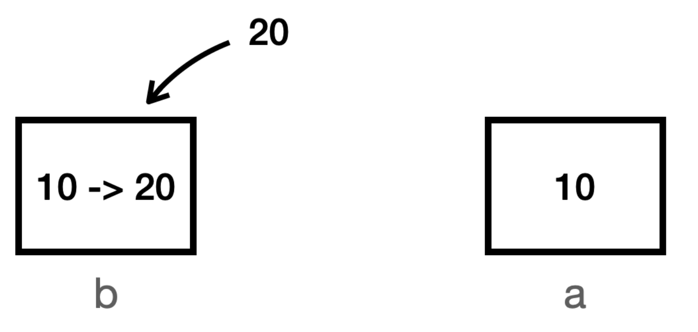
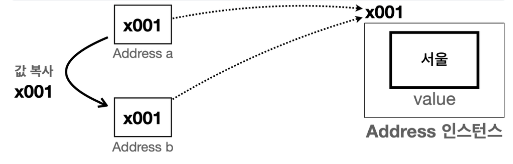

# 기본형과 참조형의 공유

자바의 데이터 타입을 가장 크게 보면 기본형(Primitive Type)과 참조형(Reference Type)으로 나눌 수 있다.   
- **기본형**: 하나의 값을 여러 변수에서 절대로 공유하지 않는다.
- **참조형**: 하나의 객체를 참조값을 통해 여러 변수에서 공유할 수 있다.

```java
package lang.immutable.address;

public class PrimitiveMain {
    public static void main(String[] args) {
        //기본형은 절대로 같은 값을 공유하지 않는다.
        int a = 10;
        int b = a; //a -> b, 값 복사 후 대입
        System.out.println("a = " + a);
        System.out.println("b = " + b);

        b = 20;
        System.out.println("20 -> b");
        System.out.println("a = " + a);
        System.out.println("b = " + b);
    }
}
```
- 기본형 변수 `a` 와 `b` 는 절대로 하나의 값을 공유하지 않는다.
- `b = a` 라고 하면 **자바는 항상 값을 복사해서 대입** 한다. (`a`의 `10` 을 복사해서 `b` 에 전달)
- 결과적으로 `a` 와 `b` 는 둘다 `10` 이라는 똑같은 숫자의 값을 가진다. 
  - 하지만 `a`의 `10`과 `b`의 `10` 은 **복사된 완전히 다른 `10`** 
  - 메모리상에서도 `a`의 `10`과 `b`의 `10` 은 각각 별도로 존재한다.



```java
package lang.immutable.address;

public class RefMain_1 {
    public static void main(String[] args) {
        //참조형 변수는 하나의 인스턴스를 공유할 수 있다.
        Address a = new Address("서울");
        Address b = a;
        System.out.println("a = " + a);
        System.out.println("b = " + b);

        b.setValue("부산"); //b의 값을 부산으로 변경해야 함
        System.out.println("부산 -> b");
        System.out.println("a = " + a);
        System.out.println("b = " + b);
    }
}
```    



- 참조형 변수들은 같은 참조값을 통해 같은 인스턴스를 참조할 수 있다. 
- `b = a` 라고 하면 `a` 에 있는 참조값 `x001` 을 복사해서 `b` 에 전달한다. 
- 참조값을 복사해서 전달하므로 결과적으로 `a`, `b` 는 같은 `x001` 인스턴스를 참조한다.
- 참조형 변수는 참조값을 통해 같은 객체(인스턴스)를 공유할 수 있다.
