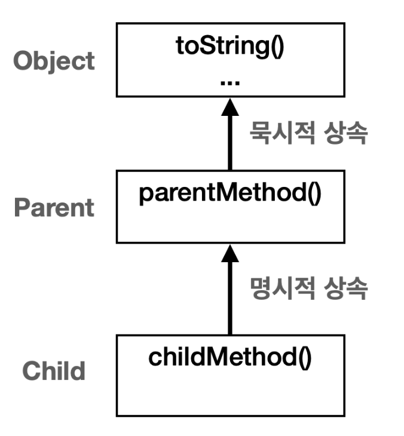
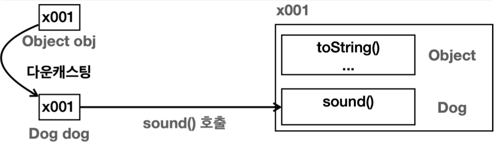
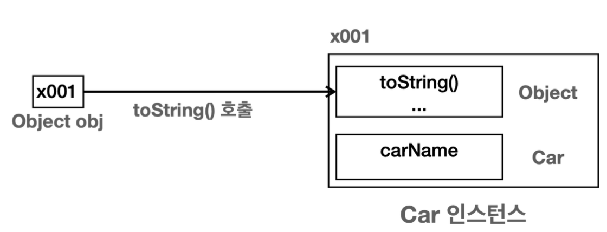
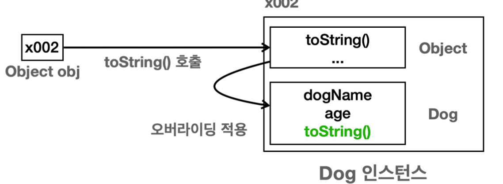

## java.lang 패키지

`lang` 은 `Language` (언어)의 줄임말이다.  
자바 언어를 이루는 가장 기본이 되는 클래스들을 보관하는 패키지를 뜻한다.

### java.lang 패키지의 대표적인 클래스들

- `Object` : 모든 자바 객체의 부모 클래스
- `String` : 문자열
- `Integer`, `long`, `Double` : 래퍼 타입, 기본형 데이터 타입을 객체로 만든 것
- `Class` :  클래스 메타 정보
- `System` : 시스템과 관련된 기본 기능들을 제공

### import 생략 가능

`java.lang` 패키지는 모든 자바 애플리케이션에서 **자동으로(`import`)된다.**

```java
package lang;

//import java.lang.System; //자바가 생략하게 허용해 준다

public class LangMain {
    public static void main(String[] args) {
        System.out.println("hello java");
    }
}
```

`import java.lang.System;` 은 생략해도 정상 동작한다.

# Object 클래스

자바에서 모든 클래스의 최상위 부모 클래스는 항상 `Object`클래스이다.

```java
package lang.object;

//부모가 없으면 묵시적으로 Object 클래스를 상속받는다.
//public class Parent extends Object {
public class Parent {

    public void parentMethod() {
        System.out.println("Parent.parentMethod");
    }
}
```

- 클래스에 상속 받을 부모 클래스가 없으면 묵시적으로 `Object` 클래스를 상속 받는다. 
- 자바가 `extends Object` 코드를 넣어준다. 
- `extends Object` 는 생략하는 것을 권장


```java
package lang.object;

public class Child extends Parent { //명시적 상속
    public void childMethod() {
        System.out.println("Child.childMethod");
    }
    
}
```
- 클래스에 상속 받을 부모 클래스를 명시적으로 지정하면 `Object` 를 상속 받지 않는다.
  - 이미 명시적으로 상속했기 때문에 자바가 `extends Object` 코드를 넣지 않는다.



> **묵시적(Implicit) vs 명시적(Explicit)**  
> - 묵시적: 개발자가 코드에 직접 기술하지 않아도 시스템 또는 컴파일러에 의해 자동으로 수행되는 것을 의미   
> - 명시적: 개발자가 코드에 직접 기술해서 작동하는 것을 의미

## 자바에서 Object 클래스가 최상위 부모 클래스인 이유

### 공통 기능 제공

모든 객체에게 필요한 기본 기능을 상속받기 위해서이다.
`Object`는 최상위 부모 클래스이기 때문에 모든 객체는 공통 기능을 편리하게 제공(상속) 받을 수 있다.

#### `Object`가 제공하는 기능
- 객체의 정보를 제공하는 `toString()`
- 객체의 같음을 비교하는 `equals()`
- 객체의 클래스 정보를 제공하는 `getClass()`
- 기타 등등

### 다형성의 기본 구현

부모는 자식을 담을 수 있다.
> `Object`클래스는 모든 클래스의 부모 클래스이므로 모든 객체를 참조할 수 있다.

`Object` 클래스는 다형성을 지원하는 기본적인 메커니즘을 제공한다.   
모든 자바 객체는 `Object` 타입으로 처리될 수 있으며, 이는 다양한 타입의 객체를 통합적으로 처리할 수 있게 해준다.  -> `다형성!` 

쉽게 이야기해서 `Object` 는 모든 객체를 다 담을 수 있다. 타입이 다른 객체들을 어딘가에 보관해야 한다면 바로 `Object` 에 보관하면 된다.

## Object 다형성


`Dog` 와 `Car` 은 서로 아무런 관련이 없는 클래스이다.   
둘다 부모가 없으므로 `Object` 를 자동으로 상속 받는다.

부모는 자식을 담을 수 있으므로 앞의 코드를 다음과 같이 변경해도 된다.
```java
Object dog = new Dog(); //Dog -> Object
Object car = new Car(); //Car -> Object
```

또한 부모는 자식의 메서드를 알지 못하므로 자식 클래스의 메서드 사용 시  
객체에 맞는 다운캐스팅이 필요하다.
```java
private static void action(Object obj) {
//if(obj instanceof Dog) { //방법1
//  ((Dog)obj).sound();
//}

    if (obj instanceof Dog dog) { //방법2
        dog.sound();
    } else if (obj instanceof Car car) {
        car.move();
    }
}
```
 
### Object 다형성의 장점

`action(Object obj)` 메서드는 `Object`타입의 매개변수를 사용한다.  
따라서 어떤 객체든지 인자로 전달할 수 있다.

```java
action(dog) //main에서 dog 전달
void action(Object obj = dog(Dog)) //Object는 자식인 Dog 타입을 참조할 수 있다.
```
```java
action(car) //main에서 car 전달
void action(Object obj = car(Car)) //Object는 자식인 Car 타입을 참조할 수 있다. 
```

### Object 다형성의 한계

```java
action(dog) //main에서 dog 전달
private static void action(Object obj) {
    obj.sound(); //컴파일 오류, Object는 sound()가 없다. 
}
```

매개변수인 `obj` 는 `Object` 타 입이기 때문이다. `Object` 에는 `sound()` 메서드가 없다.


메서드를 찾기 위해 위로 올라갈 수는 있어도 아래로 내려갈 수는 없다.  
따라서 `sound()`를 찾지 못하고 컴파일 에러가 발생한다.

`Dog` 인스턴스의 `sound()` 를 호출하려면 다음과 같이 다운캐스팅을 해야한다.
```java
 if (obj instanceof Dog dog) {
     dog.sound();
}
```



`Object obj`의 참조값을 `Dog dog`로 다운캐스팅 하면서 전달할 수 있다.  
`dog.sound()`를 호출하면 `Dog` 타입에서 `sound`를 찾는다.

**Object 다형성의 한계 정리**
- `Object` 는 모든 객체를 대상으로 다형적 참조를 할 수 있다.
  - `Object` 는 모든 객체의 부모이므로 모든 객체를 담을 수 있다. 

> `Object` 를 통해 전달 받은 객체를 호출하려면 각 객체에 맞는 다운캐스팅 과정이 필요하다.
  `Object` 가 세상의 모든 메서드를 알고 있는 것이 아니다.

다형성을 제대로 활용하려면 `다형적 참조 + 메서드 오버라이딩`을 함께 사용해야 한다. 

`Object` 는 모든 객체의 부모이므로 모든 객체를 대상으로 다형적 참조를 할 수 있다.
하지만 다른 객체의 메서드가 정의되어 있지 않으므로 **메서드 오버라이딩을 활용 할 수 없다.**

결국 각 객체의 기능을 호출하려면 `다운캐스팅`을 해야 한다. -> 단점


## Object 배열

`Object` 는 모든 타입의 객체를 담을 수 있다. 따라서 `Object[]` 을 만들면 세상의 모든 객체를 담을 수 있는 배열을
만들 수 있다.

```java
package lang.object.poly;

public class ObjectPloyExample2 {
    public static void main(String[] args) {
        Dog dog = new Dog();
        Car car = new Car();
        Object object = new Object(); //Object 인스턴스도 만들 수 있다.

        Object[] objects = {dog, car, object};
        size(objects);
    }

    private static void size(Object[] objects) {
        System.out.println("전달된 객체의 수는: " + objects.length);
    }
}

```

**objects 배열의 모습**


**size() 메서드**  
`Object`타입만 사용하기 때문에 이후에 배열에 새로운 클래스가 추가되거나 변경되어도 수정할 필요가 없는 메서드이다.

`size()` 메서드는 자바를 사용하는 곳이 라면 어디든지 사용될 수 있다.


## toString()

**toString() 메서드의 소스코드**
```java
 public String toString() {
        return getClass().getName() + "@" + Integer.toHexString(hashCode());
    }
```
`getName()` : 클래스명 정보 얻기  
`Integer.toHexString(hashCode())` : 객체의 참조값(해시코드)를 16진수로 제공 
  

```java
//toString() 반환값 출력
System.out.println(string); //java.lang.Object@2a84aee7
//클래스에 대한 정보@참조값

//object 직접 출력
System.out.println(object); ////java.lang.Object@2a84aee7
```

코드의 결과가 완전히 같다.  
`System.out.println()` 메서드는 사실 내부에서 `toString()` 을 호출한다.  
`Object` 타입(자식 포함)이 `println()` 에 인수로 전달되면 내부에서 `obj.toString()` 메서드를 호출해서 결과를 출력한다.
```java
 public void println(Object x) {
     String s = String.valueOf(x);
     //...
}
```
```java
 public static String valueOf(Object obj) {
     return (obj == null) ? "null" : obj.toString();
}
```
따라서 `println()` 을 사용할 때, `toString()` 을 직접 호출할 필요 없이 **객체를 바로 전달하면 객체의 정보를 출력 할 수 있다.**

### toString() 오버라이딩


`Object.toString()` 메서드가 클래스 정보와 참조값을 제공하지만 이 정보만으로는 객체의 상태를 적절히 나타내지 못한다.  
그래서 보통 `toString()` 을 재정의(오버라이딩)해서 보다 유용한 정보를 제공하는 것이 일반적이다.


**ObjectPrinter.print(Object obj) 분석 - Car 인스턴스**


```java
ObjectPrinter.print(car) //main에서 호출

void print(Object obj = car(Car)) { //인수 전달
    String string = "객체 정보 출력: " + obj.toString();
}
```
1. `Object obj` 의 인수로 `car(Car)` 가 전달 된다.
2. 메서드 내부에서 `obj.toString()` 을 호출한다.
3. `obj` 는 `Object` 타입이다. 따라서 `Object` 에 있는 `toString()` 을 찾는다. 
4. 이때 자식에 재정의(오버라이딩)된 메서드가 있는지 찾아본다. 재정의된 메서드가 없다. `Object.toString()` 을 실행한다.

**ObjectPrinter.print(Object obj) 분석 - Dog 인스턴스**



1. `Object obj` 의 인수로 `dog(Dog)` 가 전달된다. 
2. 메서드 내부에서 `obj.toString()` 을 호출한다. 
3. `obj` 는 `Object` 타입이다. 따라서 `Object` 에 있는 `toString()` 을 찾는다. 
4. 이때 자식에 재정의(오버라이딩)된 메서드가 있는지 찾아본다. `Dog` 에 재정의된 메서드가 있다. `Dog.toString()` 을 실행한다.


**참고 - 객체의 참조값 직접 출력**  
`toString()` 이나 `hashCode()` 를 재정의하면 객체의 참조값을 출력할 수 없다.   
이때는 다음 코드를 사용하면 객체의 참조값을 출력할 수 있다. 
```java
String refValue = Integer.toHexString(System.identityHashCode(dog1));
System.out.println("refValue = " + refValue);
```

## Object와 OCP

- 개발자가 구현한 클래스에 의존하는 것 -> 좋지 않음  
- 추상적인 클래스에 의존하는 것 -> 좋음


```java
 public class ObjectPrinter {
     public static void print(Object obj) {
        String string = "객체 정보 출력: " + obj.toString();
         System.out.println(string);
     }
}
```
`Car` , `Dog` 같은 구체적인 클래스를 사용하는 것이 아니라, 추상적인 `Object` 클래스를 사용한다.

- `다형적 참조` : `Object` 타입을 매개변수로 사용해서 다형적 참조를 사용중임 (어떤 객체든 인수로 받을 수 있음) 
- `메서드 오버라이딩` : `Car` , `Dog`같은 구체적인 클래스는 `toString()`메서드를 오버라이딩 할 수 있음

> **추상적**: 여기서 말하는 추상적이라는 뜻은 단순히 추상 클래스나 인터페이스만 뜻하는 것은 아니다.   
> `Animal` 과 `Dog` , `Cat` 의 관계를 떠올려보자. `Animal` 같은 부모 타입으로 올라갈수록 개념은 더 추상적이게 되고, `Dog` , `Cat` 과 같이 하위 타입으로 내려갈 수록 개념은 더 구체적이게 된다.

### OCP 원칙

- **Open**: 새로운 클래스를 추가하고, `toString()` 을 오버라이딩해서 기능을 확장할 수 있다. 
- **Closed**: 새로운 클래스를 추가해도 `Object` 와 `toString()` 을 사용하는 클라이언트 코드인
`ObjectPrinter` 는 변경하지 않아도 된다.

### System.out.println()

`System.out.println()` 메서드도 `Object` 매개변수를 사용하고 내부에서 `toString()` 을 호출한다.  
-> 따라서 어떤 객체든 print 가능했음 (마치 예시의 `ObjectPrinter` 메서드처럼)

> **자바 언어는 객체지향 언어 답게 언어 스스로도 객체지향의 특징을 매우 잘 활용한다.**

### 참고 - 정적 의존관계 vs 동적 의존관계

- 정적 의존관계 
  - 컴파일 시간에 결정되며, 주로 클래스 간의 관계를 의미 
  - 프로그램을 실행하지 않고, 클래스 내에서 사용하는 타입들만 보면 쉽게 의존관계를 파악할 수 있다.
  - (코드만 보면 알 수 있는..)
  
- 동적 의존관계
  - 런타임에 확인할 수 있는 의존관계
  - `ObjectPrinter.print(Object obj)` 에 인자로 어떤 객체가 전달 될지는 프로그램을 실행해봐야 알 수 있다. 
  - 런타임에 어 떤 인스턴스를 사용하는지를 나타내는 것이 동적 의존관계이다.
    
참고로 단순히 의존관계 또는 어디에 의존한다고 하면 주로 정적 의존관계를 뜻한다.  
    예) `ObjectPrinter` 는 `Object` 에 의존한다.

## equals()

`Object` 는 동등성 비교를 위한 `equals()` 메서드를 제공한다.

자바는 두 객체가 같다라는 표현을 2가지로 분리해서 제공한다.
- **동일성(Identity)**: `==` 연산자를 사용해서 두 객체의 참조가 동일한 객체를 가리키고 있는지 확인 
  - **물리적으로** 같은 메모리에 있는 객체 인스턴스인지 참조값 비교
- **동등성(Equality)**: `equals()` 메서드를 사용하여 두 객체가 논리적으로 동등한지 확인
  - **논리적으로** 같은지 비교

```java
User a = new User("id-100") //참조 x001 
User b = new User("id-100") //참조 x002
```
- 물리적으로 -> 다른 메모리에 있는 다른 객체
- 논리적으로 -> 주민번호가 같은 User

```java
 public boolean equals(Object obj) {
        return (this == obj);
    }
```
`equals()` 메서드는 기본적으로 동일성 비교를 제공, 동등성 비교를 하고 싶다면 클래스에서 오버라이딩 해야 함!  
-> 논리적으로 같다고 판단하는 기준이 클래스마다 다를 수 있기 때문임

### equals() 구현

```java
package lang.object.equals;

public class UserV2 {
    private String id;

    public UserV2(String id) {
        this.id = id;
    }

    @Override
    public boolean equals(Object obj) {
        UserV2 user = (UserV2) obj; //obj를 UserV2로 캐스팅 -> 필드 id를 찾기 위해서
        return id.equals(user.id); //String 비교 시에는 equals 메서드를 사용해야 한다 -> 자바에서 같은 문자열인 경우 최적화를 해준다고 했는데 그것 때문인듯?
    }
}
```
- `Object` 의 `equals()` 메서드를 재정의했다.
- `UserV2` 의 동등성은 `id` (고객번호)로 비교한다.
- `equals()` 는 `Object` 타입을 매개변수로 사용한다. 따라서 객체의 특정 값을 사용하려면 다운캐스팅이 필요
하다.
- 여기서는 현재 인스턴스( `this` )에 있는 `id` 문자열과 비교 대상으로 넘어온 객체의 `id` 문자열을 비교한다.
- `UserV2` 에 있는 `id` 는 `String` 이다. 문자열 비교는 `==` 이 아니라 `equals()` 를 사용해야 한다.

### 정확한 equals() 구현


```java
//변경 - 정확한 equals 구현, IDE 자동 생성 @Override
public boolean equals(Object o) {
     if (this == o) return true;
     if (o == null || getClass() != o.getClass()) return false;
     User user = (User) o;
     return Objects.equals(id, user.id);
}
```

**equals() 메서드를 구현할 때 지켜야 하는 규칙**

- **반사성(Reflexivity)**: 객체는 자기 자신과 동등해야 한다. ( `x.equals(x)` 는 항상 `true` ). 
- **대칭성(Symmetry)**: 두 객체가 서로에 대해 동일하다고 판단하면, 이는 양방향으로 동일해야 한다. (`x.equals(y)` 가 `true` 이면 `y.equals(x)` 도 `true` ).
- **추이성(Transitivity)**: 만약 한 객체가 두 번째 객체와 동일하고, 두 번째 객체가 세 번째 객체와 동일하다면, 첫 번째 객체는 세 번째 객체와도 동일해야 한다.
- **일관성(Consistency)**: 두 객체의 상태가 변경되지 않는 한, `equals()` 메소드는 항상 동일한 값을 반환해야 한다.
- **null에 대한 비교**: 모든 객체는 `null` 과 비교했을 때 `false` 를 반환해야 한다.

실무에서는 ide가 만들어준 메서드를 쓴다.

동일성 비교가 필요한 경우에만 `equals()`를 재정의하면 된다.